# Java

## :eagle:Java 内存管理

Java 内存管理是指 Java虚拟机如何对 Java程序的内存进行分配、使用和回收的过程。由于 Java 是一种自动内存管理的编程语言，程序员不需要手动分配和释放内存，而是由 JVM 负责管理内存的生命周期。

主要的内存区域包括：

1. 堆内存

   堆是 Java 程序运行存储对象实例的区域。所有通过 “new” 关键字创建的对象都存储在堆上。堆的大小可以通过 JVM 启动参数进行配置，它负责存储和管理大多数 Java 对象。堆内存在 JVM 启动时创建，并在程序结束时才释放。垃圾回收器负责在堆上进行垃圾回收，回收不再使用的对象以便释放内存。

2. 栈内存

   栈用于存储方法的调用和局部变量。每个线程都有自己的栈，栈内存会随着方法调用和返回动态地分配和释放。方法的参数和局部变量存储在栈上，并在方法执行结束后立即释放。

3. 方法区

   方法区用于存储类的信息、静态变量、常量和字节码等。它是所有线程共享的区域。在 Java8 以上的版本中，方法区被替代为 元空间，用于存储类的元数据。

堆内存、栈内存、方法区都是 JVM 定义的规范，其实现方式可能会随着版本改变。比如 JDK8 之前版本的 HotSpot 方法区使用永久代实现方法区，而 JDK8 之后的HotSpot 方法区使用元空间实现。

内存管理的核心是垃圾回收，垃圾回收器会周期性地运行，查找并回收不再使用的对象，释放堆内存空间。Java 虚拟机提供了不同类型的垃圾回收器，可以根据应用程序的需求选择合适的回收策略。

为了优化 Java 内存管理，开发者可以遵循以下几点：

1. 尽量避免创建不必要的对象，减少垃圾回收的负担
2. 及时释放不再使用的对象引用，避免内存泄漏。
3. 避免过度使用静态变量和全局变量，限制其生命周期，避免内存持续占用。
4. 根据应用程序的特点，调整堆内存大小和垃圾回收器的配置。

Java 中，内存泄露是指程序中的对象不再被使用时被没有并正确释放，从而造成内存的持续增加，最终导致内存资源耗尽或变得不足。内存泄漏是一种常见的软件缺陷，特别在长时间运行的程序中可能导致严重的性能问题和程序崩溃。Java 是一种自动内存管理的编程语言，它通过垃圾回收机制来自动处理对象的内存分配和释放，但在编写 Java 代码时，仍然有可能发生内存泄露。

以下是一些可能导致 Java 内存泄漏的常见情况：

1. 长生命周期的对象持有短生命周期对象的引用

   如果一个长生命周期的对象持有一个短声明周期对象的引用，并长生命周期对象在后续的使用中没有释放这个引用，那么短声明周期对象就无法被垃圾回收器回收，从而导致内存泄漏

   ```java
   package leak;
   
   public class LongLivedObjectHasShortLivedObjectLeak {
   
       private LivedObject longLivedObject;
   
       public LongLivedObjectHasShortLivedObjectLeak() {
           longLivedObject = new LivedObject();
       }
   
       public void doSomething() {
           final LivedObject shortLivedObject = new LivedObject();
           longLivedObject.setLivedObject(shortLivedObject);
   
           // 其他操作
   
           // 此时，longLivedObject 持有 shortLivedObject 的引用
           // 即使在 doSomething 方法执行结束后，shortLivedObject 可能不再被使用
           // 由于 shortLivedObject 还在被 LongLivedObject 引用着，垃圾回收器无法回收 shortLivedObject，造成内存泄漏
   
       }
   
       private static class LivedObject {
           private LivedObject livedObject;
   
           public void setLivedObject(LivedObject livedObject) {
               this.livedObject = livedObject;
           }
       }
   }
   
   ```

   

2. 静态集合类未正确清理

   当使用静态集合类（如HashMap、ArrayList等）时，如果对象在集合中注册了监听器或回调，但未正确地从集合中移除，这些都西昂将无法被垃圾回收器回收，导致内存泄漏。

   ```java
   package leak;
   
   import java.util.ArrayList;
   import java.util.List;
   
   public class StaticCollectionNotClearLeak {
   
       private static List<String> sharedList = new ArrayList<>();
   
   
       public static void main(String[] args) {
           for (int i = 0 ; i < 1_000_000 ; i ++ ) {
               addItemToSharedList("Item " + i);
           }
           System.out.println("Items added to the sharedList.");
   
           // 在这里没有对sharedList进行清理或重置为null
           // 因此，在main方法结束后，sharedList依然引用着大量的String对象
       }
   
       public static void addItemToSharedList(String value) {
           sharedList.add(value);
       }
   }
   ```

   

3. 未关闭资源

   Java中的一些资源，如文件流、数据库连接、网络连接等，在使用完毕后需要手动关闭，如果程序没有正确关闭这些资源，会造成资源泄漏，进而导致内存泄漏

   ```java
   package leak;
   
   import util.FileUtils;
   
   import java.io.File;
   import java.io.FileNotFoundException;
   import java.io.FileReader;
   import java.io.IOException;
   import java.util.Scanner;
   
   public class FileResourceNotCloseLeak {
   
       public static void main(String[] args) {
           File file = null;
           try {
               file = FileUtils.createFileIfNecessary("sample.txt");
           } catch (IOException e) {
               e.printStackTrace();
           }
           try {
               final Scanner scanner = new Scanner(new FileReader(file));
               while (scanner.hasNext()) {
                   System.out.println(scanner.nextLine());
               }
               // 没有关闭 FileReader 和 scanner，会造成文件资源泄漏
               // reader.close() 或者 使用 try-with-resource 来确保资源关闭
           } catch (FileNotFoundException e) {
               e.printStackTrace();
           }
   
       }
   
   }
   ```

   

4. 匿名内部类的使用

   在匿名内部类中引用外部类的实例时，由于匿名类内部持有了外部类的引用，导致外部类无法被垃圾回收器回收，从而引发内存泄漏

   ```java
   package leak;
   
   import java.util.ArrayList;
   import java.util.List;
   
   public class AnonymousInnerClassLeak {
   
       public static void main(String[] args) {
           new AnonymousInnerClassLeak().doSomething();
       }
   
       public void doSomething() {
           // 假设从这里获取了数据
           final List<String> data = fetchData();
   
           // 创建匿名内部类，持有对外部 data 的引用
           // 匿名内部类使用外部 data
           final Runnable processDataRunnable = () -> processData(data);
   
           // 模拟将匿名内部类对象传给其他线程或异步任务执行
           final Thread thread = new Thread(processDataRunnable);
           thread.start();
   
           // 假设这里不再需要 processDataRunnable 对象，
           // 但由于 processDataRunnable 持有堆对 data 的引用
           // data 无法被垃圾回收器回收，造成内存泄漏
       }
   
       private void processData(List<String> data) {
           data.stream().forEach(System.out::println);
       }
   
       private List<String> fetchData() {
           final ArrayList<String> data = new ArrayList<>();
           for (int i = 0 ; i < 1_000 ; i ++ ) {
               data.add("data " + i);
           }
           return data;
       }
   
   }
   
   ```


## :hatching_chick:集合框架


Java 集合框架是 Java 标准库中提供的一组用于存储和操作数据集合的类和接口，提供了许多实用的数据结构和算法，使得数据的管理和处理更加高效和便捷。Java 集合框架包括以下部分：

1. 接口

   Java 集合框架定义了一些核心接口，如 `Collection, List, Set, Map`  等，这些接口规定了不同类型的集合的共同行为和方法。	

2. 实现类

   Java 集合框架提供了实现上述接口的具体类，开发者可以根据需求选择合适的实现类，开发者可以根据需求选择合适的实现类。例如，`ArrayList, LinkedList` 实现了 `List` 接口；`HashSet, TreeSet` 实现了 `Set` 接口，`HashMap, TreeMap` 实现了 `Map` 接口。

3. 工具类

   Java 集合框架还提供了一些实用的工具类，如 `Collections` 类，它包含了许多静态方法，用于对集合进行排序、查找、填充等操作。

4. 迭代器

   Java 集合框架提供了迭代器 `Iterator` 接口，它允许开发者遍历集合中的元素，而不需要了解集合的底层结构。

5. 泛型

   Java 集合框架使用泛型来确保类型安全，使得集合可以存储特定类型的元素，避免了强制类型转换和运行时错误。

Java 集合框架可以根据数据的需求选择不同的集合类，例如：

- 使用 `ArrayList` 来存储有序的元素列表，因为它提供了快速的随机访问能力
- 使用 `HashSet` 来存储唯一元素的集合，因为它不允许重复元素
- 使用 `HashMap` 来实现键值对的存储，可以根据键查找

**Set List Queue** 三个接口都继承自 **Collection** ，它们三者有什么区别 

### Set

1. 表示一组不允许重复元素的集合。无序的，不能通过索引访问元素。
2. 添加到 Set 中的元素不会有重复的值，因为 Set 实现类会使用元素的哈希码来保证唯一性。
3. 常用的 Set 实现类有 `HashSet(基于哈希表) TreeSet(基于红黑树)` 等。
4. 适用于需要保持元素唯一性的场景

```java
public class SetExample implements Giver<Set<Object>> {

    @Override
    public Set<Object> give() {
        // 创建一个 HashSet 来存储 Object 对象
        final HashSet<Object> set = new HashSet<>();

        // 添加一些元素
        set.add(11);
        set.add(11);    // 重复的元素不会被添加

        // Set 根据 hashCode() 和 equals(Object) 来判别两个对象是否相等
        // SameHashCodeEqualObject 类的 hashCode() 只返回 1，equals 只返回 true
        // 那么 Set 在 执行 add() 时，会将所有其他 SameHashCodeEqualObject 视作相同的对象
        // 所以即使创建的 SameHashCodeEqualObject 对象的内容不同，但是只会被添加一次
        for (int i = 0 ; i < 3000 ; i ++ ) {
            set.add(new SameHashCodeEqualObject("item " + i));
        }
        return set;
    }

    public static class SameHashCodeEqualObject {

        private String content;

        public SameHashCodeEqualObject(String content) {
            this.content = content;
        }

        @Override
        public int hashCode() {
            return 1;
        }

        @Override
        public boolean equals(Object o) {
            return true;
        }

        @Override
        public String toString() {
            return "SameHashCodeObject{" +
                    "content='" + content + '\'' +
                    '}';
        }
    }
}

```


### List

1. 表示一组有序的元素列表。每个元素在列表中都有一个索引，可以根据索引来访问元素。
2. List 允许重复元素，即可以包含相同的值
3. 常用的 List 实现类有 `ArrayList(动态数组) LinkedList(双向链表)` 等
4. 适用于有序列表元素的场景

```java
public class ListExample implements ExampleGiver<List<Object>> {
    @Override
    public List<Object> example() {

        final ArrayList<Object> list = new ArrayList<>();

        // 添加元素到 list
        list.add("Alice");
        list.add("Bob");
        list.add("Alice");      // list 允许重复元素

        list.add(114514L);

        return list;
    }
}
```


### Queue

1. 表示一种特殊的集合，用于存储和管理元素的顺序，通常使用 FIFO 顺序或者优先级顺序
2. Queue 主要用于任务调度、消息传递等场景
3. 常用的 Queue 实现类有 `LinkedList(双向链表，可以模拟队列和双端队列) PriorityQueue(基于优先堆的优先队列)` 等
4. Queue 接口适用于用于管理元素顺序的（FIFO或优先级）的场景

```java
public class QueueExample implements ExampleGiver<Queue<Object>> {
    @Override
    public Queue<Object> example() {

        // 创建一个 LinkedList 来模拟队列
        final Queue<Object> queue = new LinkedList<>();

        // 添加元素到队列
        queue.offer("Alice");
        queue.offer("Bob");
        queue.offer("Carol");

        // 使用 poll() 方法按照 先进先出FIFO 顺序获取元素并删除
        while (! queue.isEmpty()) {
            System.out.print(queue.poll() + "\t");
        }

        return null;
    }

}

```


### 迭代器

在 Java 中，迭代器是一种设计模式，用于遍历集合类（如 `List, Set, Map` 等）中元素的对象，提供了一种统一的方式来访问集合中的元素，而无需了解底层集合的结构。

Java中的迭代器是通过`Iterator`接口来定义的。该接口位于`java.util`包中，它定义了一组方法，允许我们在不直接操作集合底层数据结构的情况下，安全地遍历集合中的元素。

以下是 Iterator 接口常用的方法：

1. `boolean hasNext()` 判断是否还有下一个元素可以遍历
2. `E next()` 返回集合中的下一个元素
3. `void remove()` 从集合中移除通过 `next()` 方法返回的最后一个元素

在使用迭代器时，需要注意以下要点：

1.  在调用 `next()` 前使用 `hasNext()` 判断是否还有下一个元素可以遍历，并使用 `next()` 方法获取当前元素。通过循环遍历整个集合：
2. 避免在遍历时修改集合：当在遍历时，集合结构发生变化（例如删除和添加），迭代器会抛出此异常。
3. 迭代器提供了 `remove()` 方法，用于在遍历过程中移除集合中的元素。需要注意，该方法应该在调用 `next()` 之后、在修改集合结构之前


```java
package iterator;

import java.util.HashSet;
import java.util.Iterator;
import java.util.List;

public class IteratorDemo {

    public static void main(String[] args) {
        String[] strings = new String[10];
        for (int i = 0 ; i < 10 ; i ++ ) {
            strings[i] = "Item " + i;
        }

        // Set 是无序集合，它不保持元素的插入顺序，元素之间没有明确的顺序。
        // 因此，通过 Set 的迭代器遍历时，元素的顺序可能是不确定的。
        System.out.println("===== Set 迭代器 =====");
        final HashSet<String> set = new HashSet<>(List.of(strings));
        Iterator<String> setIterator = set.iterator();
        printIterator(setIterator);

        // List 是有序集合，它保持了元素的插入顺序。
        // 因此，通过 List 的迭代器遍历时，元素的顺序将按照插入的顺序依次遍历。
        System.out.println("===== List 迭代器 =====");
        final List<String> list = List.of(strings);
        Iterator<String> listIterator = list.iterator();
        printIterator(listIterator);

        // 使用迭代器删除特定元素
        setIterator = set.iterator();
        removeElement(setIterator, "Item 1");
        

    }

    private static void printIterator(Iterator<?> iterator) {
        // 遍历前检查是否有下一个元素
        while (iterator.hasNext()) {
            // 遍历过程中不允许修改集合元素
            System.out.println(iterator.next());
        }
    }
    
    private static void removeElement(Iterator<?> iterator, Object value) {
        // 遍历前检查是否有下一个元素
        while (iterator.hasNext()) {
            // 在确保 next() 获取非空元素的情况下，每次只使用一次 remove()
            // 使用迭代器的 remove() 方法删除元素时，需要确保删除的是上一次调用 next() 方法获取的元素。
            // 如果在调用 remove() 方法之前没有调用 next() 方法或在调用 next() 后又调用了 remove() 方法，可能会引发 IllegalStateException 异常。
            final Object toRemove = iterator.next();
            if (toRemove.equals(value)) {
                iterator.remove();
                System.out.println(toRemove);
            }
        }
    }
}

```


### ArrayList VS LinkedList

ArrayList 和 LinkedList 是 Java 集合框架中 List 接口的两种常用实现。它在性能方面有不同的特点，适用于不同的使用场景。下面对它们进行性能对比：

#### ArrayList

- 底层数据结构：基于动态数组实现
- 随机访问性能好：由于是基于数组，通过索引可以快速随机访问元素，时间复杂度为 O(1)
- 插入和删除性能较差：插入和删除元素可能需要移动其他元素，特别是数组中见或者开头进行插入和删除操作，时间复杂度为 O(n)
- 适用场景：当需要频繁进行随机访问，并且插入和删除操作较少时，ArrayList 是较好的选择

#### LinkedList

- 底层数据结构：基于双链表实现
- 随机访问性能较差：由于是链表结构，随机访问需要从头节点或者尾节点开始遍历链表，时间复杂度为 O(n)
- 插入和删除性能较好：在链表中插入和删除元素只需要修改引用，时间复杂度为 O(1)
- 适用场景：当需要频繁进行插入和删除操作，并且随机访问较少时，LinkedList 是较好的选择

#### 总结

- ArrayList 适合频繁随机访问元素，但插入和删除操作较少的场景。
- LinkedList 适合频繁插入和删除元素，但随机访问较少的场景。

### HashTable VS HashMap

HashMap 和 HashTable 都是 Java 中用于实现键值对的实现类，它们的区别如下：

1. 线程安全性
   - HashMap 是非线程安全的。多个线程可以同时对 HashMap 进行读写操作，但在并发读写的情况下，可能导致不确定的结果
   - HashTable 是线程安全的。HashTable 的所有方法都是同步的，因此多个线程可以安全地同时对 HashTable 进行读写操作
2. null 键 和 null 值
   - HashMap 允许键和值都为 null。这意味着可以将 null 值作为键或值放入 HashMap
   - HashTable 不允许允许键或值为 null。如果这么做，将会抛出 NullPointerException 
3. 继承关系
   - HashMap 继承自 AbstractMap 类，并实现了 Map 接口
   - HashTable 继承自 Dictionary 类，并实现了 Map 接口。Dictonary 现在已经过时，不再推荐使用。
4.  性能
   - 在单线程情况下，HashMap 的性能通常比 HashTable 更好，因为它不需要额外的同步开销
   - 在多线程情况下，虽然 HashTable 提供了线程安全，但由于所有方法都是同步的，可能会导致性能下降。而 HashMap 在多线程环境下需要额外的同步机制来保证线程安全。

### TreeMap 和 HashMap 的区别

1. 底层数据结构

   - HashMap：使用哈希表（数组+链表或者红黑树）实现。哈希表根据键的哈希码来快速定位数组中的位置，然后通过链表或者红黑树来处理哈希冲突。
   - TreeMap：使用红黑树实现，红黑树是一种自平衡二叉搜索树。它保持键的有序性，即键值对按照键的自然顺序或自定义比较器的顺序排列。
2. 排序
   - HashMap：不保证元素的顺序，无法保证元素的存储顺序和遍历顺序一致
   - TreeMap：根据键的自然顺序或者通过传入的比较器对键进行排序，保持元素按键的有序状态，保持元素按键的有序状态
3. 性能
   - HashMap：在插入、查找和删除的平均复杂度为 O(1)。在哈希冲突较少的情况下，性能非常高效
   - TreeMap：适用于需要按键有序存储元素，或者根据键的自然顺序进行遍历的场景。在这种情况下，TreeMap 可以更方便地得到有序的结果
4. 适用场景
   - HashMap：适用于大部分情况，特别是需要高效插入、查找和删除元素，并不关心元素顺序的场景
   - TreeMap：适用于需要按键有序存储元素，或者根据键的自然顺序进行遍历的场景。在这种情况下，TreeMap 可以更加方便地得到有序的结果

需要注意的是，HashMap和TreeMap都不是线程安全的。如果在多线程环境下使用它们，需要采取额外的同步措施来保证线程安全。

## :monkey:泛型

### 基本介绍

Java 泛型是 Java 编程语言中引入的一种特性，它允许在定义类、接口和方法时使用类型参数，以实现代码的重用和类型安全。泛型提供了编译时类型检查，并使得代码更加灵活和通用。

使用泛型时可以将类型作为参数传递，而不是在代码中直接指定具体的类型。这样可以增加代码的灵活性，使得一个类、接口或者方法可以用于多种类型的数据，而不现定于特定的数据类型。

泛型的优点包括：

1. 类型安全

   编译器会在编译时进行类型检查，确保代码不会发生类型转换异常。

2. 代码重用

   可以编写通用的代码，可以用于处理多种不同类型的数据

3. 简化代码

   避免了手动进行类型转化，使代码更加简洁

泛型的语法使用尖括号（<>）来定义类型参数，通常使用单个大写字母表示，比如 `<T>`，`<K>`，`<V>` 等。在类、接口、方法的定义中，使用这些类型参数来代表具体的类型。

定义一个简单的泛型类

```java
public class GenericCalculator<T extends Number> {

    public double add(T x, T y) {
        return x.doubleValue() + y.doubleValue();
    }

    public double sub(T x, T y) {
        return x.doubleValue() - y.doubleValue();
    }

    public double mul(T x, T y) {
        return x.doubleValue() * y.doubleValue();
    }

    public double div(T x, T y) {
        return x.doubleValue() / y.doubleValue();
    }

}

```

```java
import java.util.Scanner;

public class GenericCalculatorTest {

    public static void main(String[] args) {
        GenericCalculator<Number> calculator = new GenericCalculator<>();
        Scanner scanner = new Scanner(System.in);
        int x = scanner.nextInt();
        byte y = scanner.nextByte();
        System.out.println(calculator.add(x, y));
    }

}
```

### 要点

使用泛型时，需要注意以下要点：

1. 类型参数

   泛型使用类型参数（Type Parameter）来表示参数化类型。类型参数通常用大写字母表示，如`T`、`E`、`K`等。类型参数在定义类、接口或方法时使用，并在使用时由具体的类型替代。

2. 类型安全

   泛型在编译时提供类型检查机制，确保代码中的类型转换是安全的。这样可以避免在运行时出现类型转换异常，提高代码的稳定性和可靠性。

3. 泛型类

   使用泛型类可以创建通用的数据结构和容器，例如列表、栈、队列等。泛型类的定义在类名后面使用尖括号括起来的类型参数列表。

4. 泛型接口

   泛型接口与泛型类类似，允许在接口中使用类型参数。这使得实现泛型接口的类也能够具有通用的特性。

5. 泛型方法

   可以在普通类中定义泛型方法，这样可以在方法级别上使用类型参数。泛型方法可以是静态的或非静态的，并且可以在调用时指定具体的类型。

6. 通配符

   通配符是指用 `?` 代替具体的类型参数。通配符通常用于在泛型类或方法中表示未知类型或者限制类型的范围。

   ```java
   package wild;
   
   import java.util.ArrayList;
   import java.util.List;
   import java.util.Random;
   
   /**
    * 上界限定 (extends)：
    * 使用上界限定可以确保泛型类型参数必须是指定类或其子类。这允许你在泛型类或方法中操作这个范围内的对象。在泛型参数后使用 extends 关键字，然后跟着上界类的名称。
    *
    * T extends Number
    * T 必须是 Number 或其子类，所以你可以传递 Integer、Double、Float。
    *
    * 下界限定 (super)：
    * 使用下界限定可以确保泛型类型参数必须是指定类或其父类。这允许你在泛型类或方法中操作这个范围内的对象。在泛型参数后使用 super 关键字，然后跟着下界类的名称。
    *
    * ? super T
    * ? super T 表示可以是 T 或其父类，所以你可以传递 List<Object>、List<Number>、List<Integer> 。
    *
    *
    */
   public class GenericWildcardTest {
   
       public static void main(String[] args) {
           // 无限制通配符
           List<?> wildcardList = new ArrayList<>();
           wildcardList = new ArrayList<Integer>();
           wildcardList = new ArrayList<Double>();
           // 无法添加元素到无限制通配符集合
           //      wildcardList.add(10);     // Error
   
           // 上界通配符
           List<? extends Number> upperBoundList = new ArrayList<>();
           upperBoundList = new ArrayList<Integer>();
           upperBoundList = new ArrayList<Double>();
           // 无法添加元素到上界通配符集合
           // upperBoundList.add(10); // Error
   
           // 下界通配符
           List<? super Integer> lowerBoundList = new ArrayList<>();
           lowerBoundList = new ArrayList<Number>();
           lowerBoundList = new ArrayList<Object>();
           lowerBoundList.add(10); //可以添加到下界通配符集合
   
           processWildcardList(new ArrayList<Integer>());
           processUpperBoundList(new ArrayList<Double>());
           processLowerBoundList(new ArrayList<Object>());
   
       }
   
       // 无限制通配符作为方法参数
       public static void processWildcardList(List<?> list) {
           // 可以访问元素，但不能添加元素到通配符集合
           list.forEach(System.out::println);
       }
   
       // 上界通配符作为方法参数
       // '?' 代表的类型作为 Number 的 子类 或者 实现类
       public static void processUpperBoundList(List<? extends Number> list) {
           // 可以访问元素，但不能添加元素到通配符集合
           list.forEach(System.out::println);
       }
   
       // 下界通配符作为方法参数
       // '?' 代表的类型作为 Number 的 父类
       public static void processLowerBoundList(List<? super Integer> list) {
           Random random = new Random(System.currentTimeMillis());
           for (int i = 0 ; i < 5 ; i ++ ) {
               list.add(random.nextInt());
           }
       }
   
   
   }
   
   ```

7. 限定类型

   泛型可以使用限定类型（Bounded Type）来约束类型参数。通过extends关键字，可以限制类型参数必须是指定类或其子类。

8. 类型擦除

   Java中的泛型是通过类型擦除实现的。在编译时，泛型信息被擦除，并替换为Object类型。这意味着在运行时，泛型的类型参数信息是不可用的。

   ```java
   package erase;
   
   import java.util.ArrayList;
   
   public class TypeErase {
   
       public static void main(String[] args) {
           ArrayList<String> stringList = new ArrayList<>();
           stringList.add("abc");
   
           ArrayList<Integer> integerList = new ArrayList<>();
           integerList.add(123);
   
           // 运行时，泛型的类型参数信息是不可用的。
           // 结果为 true
           System.out.println(stringList.getClass() == integerList.getClass());
   
       }
   
   }
   
   ```

   

9. 自动装箱与拆箱

   泛型在自动装箱和拆箱的过程中发挥重要作用。自动装箱允许在基本类型和包装类型之间自动进行转换。


### 类型擦除

#### 类型擦除机制的体现

##### 原始类型相等

```java
package erase.demo;

import java.util.ArrayList;

/**
 * 原始类型相等
 */
public class TypeEraseDemoByEqual {


    /**
     * 在这个例子中，我们定义了两个ArrayList数组，不过一个是ArrayList<String>泛型类型的，只能存储字符串；
     * 一个是ArrayList<Integer>泛型类型的，只能存储整数，最后，我们通过list1对象和list2对象的getClass()方法获取他们的类的信息，最后发现结果为true。
     * 说明泛型类型String和Integer都被擦除掉了，只剩下原始类型。
     * @param args
     */
    public static void main(String[] args) {
        ArrayList<String> stringList = new ArrayList<>();
        stringList.add("abc");

        ArrayList<Integer> integerList = new ArrayList<>();
        integerList.add(123);

        // 运行时，泛型的类型参数信息是不可用的。
        // 结果为 true
        System.out.println(stringList.getClass() == integerList.getClass());

    }

}

```


##### 通过反射添加其他元素

```java
package erase.demo;

import java.lang.reflect.InvocationTargetException;
import java.lang.reflect.Method;
import java.util.ArrayList;
import java.util.List;

/**
 * 通过反射添加其它类型元素
 */
public class TypeEraseDemoByReflection {

    /**
     *
     * 在程序中定义了一个ArrayList泛型类型实例化为Integer对象，如果直接调用add()方法，
     * 那么只能存储整数数据，不过当我们利用反射调用add()方法的时候，却可以存储字符串，
     * 这说明了Integer泛型实例在编译之后被擦除掉了，只保留了原始类型。
     *
     * @param args
     * @throws NoSuchMethodException
     * @throws InvocationTargetException
     * @throws IllegalAccessException
     */
    public static void main(String[] args) throws NoSuchMethodException, InvocationTargetException, IllegalAccessException {

        List<Integer> integerList = new ArrayList<>();
        integerList.add(1024);

        Method addObjectMethod = integerList.getClass().getMethod("add", Object.class);

        addObjectMethod.invoke(integerList, "Hello");
        addObjectMethod.invoke(integerList, new Object(){
            @Override
            public String toString() {
                return "SAMPLE";
            }
        });

        for (Object o : integerList) {
            System.out.println(o);
        }

    }

}

```


#### 类型擦除后保留的原始类型

原始类型就是擦去了泛型信息，最后在字节码中的类型变量的真正类型，无论何时定义一个泛型，相应的原始类型对会被自动提供，类型变量擦除，并使用其限定类型（无限定的变量用 Object） 替换。

ObjectPair

```java
package erase.origin;

public class ObjectPair<T> {
    private T value;

    public ObjectPair(T value) {
        this.value = value;
    }

    public T getValue() {
        return value;
    }
}
```

ObjectPair 的原始类型为

```java
package erase.origin;

public class ObjectPair {
    private Object value;

    public ObjectPair(Object value) {
        this.value = value;
    }

    public Object getValue() {
        return value;
    }
}
```

因为在`Pair<T>`中，T 是一个无限定的类型变量，所以用`Object`替换，其结果就是一个普通的类，如同泛型加入Java语言之前的已经实现的样子。在程序中可以包含不同类型的`Pair`，如`Pair<String>`或`Pair<Integer>`，但是擦除类型后他们的就成为原始的`Pair`类型了，原始类型都是`Object`。

ComparablePair

```java
package erase.origin;

public class ComparablePair<T extends Comparable> {
    private T value;

    public ComparablePair(T value) {
        this.value = value;
    }

    public T getValue() {
        return value;
    }
}
```

原始类型就是`Comparable`

ComparablePair 的原始类型

```java
package erase.origin;

public class ComparablePair {
    private Comparable value;

    public ComparablePair(Comparable value) {
        this.value = value;
    }

    public Comparable getValue() {
        return value;
    }
}
```

#### 调用时指定泛型和不指定泛型

- 在不指定泛型的情况下，泛型变量的类型为该方法中的几种类型的同一父级的最小级，直到 Object

  ```java
  public class ComparablePairTest {
  
      private static class NormalClass {
      }
  
      private static class ComparableImplementationClass implements Comparable {
  
          @Override
          public int compareTo(Object o) {
              return 0;
          }
      }
  
      private static class ComparableImplementationClassSon extends ComparableImplementationClass {
      }
  
      public static void main(String[] args) {
          // ComparablePair pair = new ComparablePair(new NormalClass()); // 泛型变量的类型不为该方法中的几种类型的同一父级的最小级，ERROR
          ComparablePair<ComparableImplementationClass> pair =
                  new ComparablePair<>(new ComparableImplementationClass()); // 泛型变量的类型为该方法中的几种类型的同一父级的最小级
          ComparablePair<ComparableImplementationClassSon> sonPair
                  = new ComparablePair<>(new ComparableImplementationClassSon()); // 泛型变量的类型为该方法中的几种类型的同一父级的最小级
      }
  
  }
  ```

  

- 在指定泛型的情况下，该方法的几种类型必须是该泛型的实例的类型或者其子类

  ```java
  package invoke;
  
  import java.io.Serializable;
  
  public class InvokeGenericExplicitOrImplicit {
  
      public static void main(String[] args) {
          /** 不指定泛型 **/
          Integer integer = add(1, 2);        // 这两个参数都是 Integer，所以 T 为 Integer
          Number f = add(1, 1.2);             // 一个是 Integer，一个是 Float，取同一父类的最小级 Number
          Serializable s = add(1, "add");   // 一个是 Integer，一个是 String，取同一父类的最小级 Serializable
  
          /** 指定泛型 **/
          Integer integer1 = InvokeGenericExplicitOrImplicit.<Integer>add(1, 2);  // 指定了 Integer，所以只能为 Integer 或者其子类
          // Integer f = InvokeGenericExplicitOrImplicit.<Integer>add(1, 2.2);         // 编译错误，指定了 Integer，不能为 Float
          Number number = InvokeGenericExplicitOrImplicit.<Number>add(1, 2.2);    // 指定为 Number，所以可以为 Float 或者 Integer
      }
  
      public static <T> T add(T x, T y) {
          return y;
      }
  
  }
  
  ```

  

### 类型擦除引起的问题以及解决方案

Java 的泛型是伪泛型，通过类型擦除来实现，以避免了类型膨胀问题，但是也引发了许多问题，所以JDK对这些问题做出了种种限制，避免错误发生。

#### 泛型检查后再编译以及以及编译的对象和引用传递问题

Java 编译器通过先检查代码中泛型的类型，然后再进行类型擦除，再进行编译。也就是类型检查是在编译时完成的。

所以当往 ArrayList\<Integer\> 中添加 "abc" 时，Java 编译器检查出泛型类型不相符，报错。但是可以通过反射等方式逃脱Java编译器的检查。

需要注意，类型检查是由引用完成而非引用的对象，见下例

```java
package erase.check;

import java.util.ArrayList;

/**
 * 因为类型检查就是编译时完成的，
 * new ArrayList()只是在内存中开辟了一个存储空间，可以存储任何类型对象，而真正设计类型检查的是它的引用
 *
 * 类型检查就是针对引用的，谁是一个引用，用这个引用调用泛型方法，就会对这个引用调用的方法进行类型检测，而无关它真正引用的对象
 *
 */
public class CompileTypeCheck {

    public static void main(String[] args) {

        //list1引用能完成泛型类型的检查。
        ArrayList<String> list1 = new ArrayList();
        list1.add("1");
        // list1.add(1);    // ERROR
        // 引用指定类型，检查类型，返回 String
        String stringElement = list1.get(0);

        // 而引用list2没有使用泛型，所以不行。
        ArrayList list2 = new ArrayList<String>();
        list2.add("abc");
        list2.add(1);
        // 引用未指定类型，不检查类型，返回 Object
        Object o = list2.get(1);


    }

}

```

还需要注意，泛型中类型不考虑继承关系

```java
ArrayList<String> list1 = new ArrayList<Object>();  // 编译错误
ArrayList<Object> list2 = new ArrayList<String>();  // 编译错误
```

#### 自动类型转换

因为类型擦除机制，所以所有泛型的类型变量最后都会被替换为原始类型。

既然都被替换为原始类型，那么我们在获取的时候为什么不用强制转换呢？

在 ArrayList#get(int) 中寻找答案

```java
/**
 * Returns the element at the specified position in this list.
 *
 * @param  index index of the element to return
 * @return the element at the specified position in this list
 * @throws IndexOutOfBoundsException {@inheritDoc}
 */
public E get(int index) {
    Objects.checkIndex(index, size);
    return elementData(index);
}

E elementData(int index) {
    return (E) elementData[index];
}
```

可以看到，在 return 之前，假设泛型类型变量为 String，虽然泛型信息会被擦除掉，但是会将 `(E) elementData[index]` 编译为 `(String) elementData[index]`，所以我们不用自行强转。

### 类型擦除与多态的冲突和解决方法

现有泛型类 Box\<T\>

```java
public class Box<T> {

    private T value;

    public T getValue() {
        return value;
    }

    public void setValue(T value) {
        this.value = value;
    }
}
```

有子类 StringBox 继承于 Box，并重写 setValue

```java
package erase.bridge;

public class StringBox extends Box<String> {

    @Override
    public void setValue(String value) {
        super.setValue(value);
    }

}
```

然而，类型擦除后，父类

```java
public class Box {

    private Object value;

    public Object getValue() {
        return value;
    }

    public void setValue(Object value) {
        this.value = value;
    }
}
```

而回看子类的 setValue(String)

```java
@Override
public void setValue(String value) {
    super.setValue(value);
}
```

两者的参数列表不同，直觉上应该是重载而不是重写。这样类型擦除和多态就有了冲突。

于是 JVM 使用桥方法来解决这个冲突。

可以使用 `javap -c className` 的方式反编译 `StringBox`

```java
Compiled from "StringBox.java"
public class erase.bridge.StringBox extends erase.bridge.Box<java.lang.String> {
  public erase.bridge.StringBox();
    Code:
       0: aload_0
       1: invokespecial #1                  // Method erase/bridge/Box."<init>":()V
       4: return

  public void setValue(java.lang.String);	// 重写的 setValue 方法 
    Code:
       0: aload_0
       1: aload_1
       2: invokespecial #2                  // Method erase/bridge/Box.setValue:(Ljava/lang/Object;)V
       5: return

  public void setValue(java.lang.Object);	// 编译器生成的桥方法
    Code:
       0: aload_0
       1: aload_1
       2: checkcast     #3                  // class java/lang/String
       5: invokevirtual #4                  // Method setValue:(Ljava/lang/String;)V 调用我们重写的 SetValue 方法
       8: return
}

```

其中 public void setValue(java.lang.Object) 时 编译器生成的桥方法，而桥方法的内部实现，就只是去调用我们自己重写的方法。通过反射也可以看到桥方法。

```java
public class BridgeDemo {
    public static void main(String[] args) throws NoSuchMethodException, InvocationTargetException, IllegalAccessException {
        StringBox stringBox = new StringBox();
        Class<StringBox> clazz = StringBox.class;

        Method bridgeSetValueMethod = clazz.getMethod("setValue", Object.class);
        System.out.println(bridgeSetValueMethod.isBridge());
        // bridgeSetValueMethod.invoke(stringBox, 123); // ClassCastException

        Method overrideSetValueMethod = clazz.getMethod("setValue", String.class);
        System.out.println(overrideSetValueMethod.isBridge());
        overrideSetValueMethod.invoke(stringBox, "123");
    }
}
```

### 泛型类型不能是基本数据类型

不能用类型参数替换基本类型。就比如，没有`ArrayList<double>`，只有`ArrayList<Double>`。因为当类型擦除后，`ArrayList`的原始类型变为`Object`，但是`Object`类型不能存储`double`值，只能引用`Double`的值。

### 泛型信息对 instanceof  无效

```java
ArrayList<String> arrayList = new ArrayList<String>();
```

因为类型擦除之后，`ArrayList<String>`只剩下原始类型，泛型信息`String`不存在了。

那么，编译时进行类型查询的时候使用下面的方法是错误的

```java
if (arrayList instanceof ArrayList<String>)
```

### 泛型不可以作为静态变量，也不可以作为静态方法 的返回值

因为泛型类中的泛型参数的实例化是在定义对象的时候指定的，而静态变量和静态方法不需要使用对象来调用。对象都没有创建，如何确定这个泛型参数是何种类型，所以当然是错误的。

```java
public class Test2<T> {    
    public static T one;   //编译错误    
    public static  T show(T one){ //编译错误    
        return null;    
    }    
}
```

但是允许静态的泛型方法

```java
public class Test2<T> {    

    public static <T >T show(T one){ //这是正确的    
        return null;    
    }    
}
```

## :surfer:流

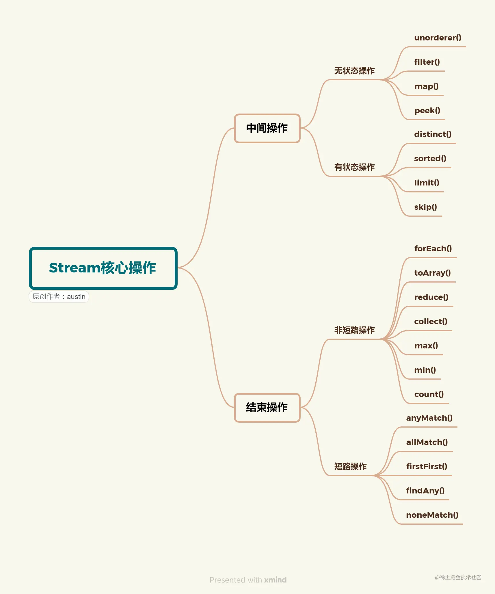

### 介绍

Java 中的流（Streams）是一种用于处理数据序列的抽象概念。它们提供了一种高效、灵活和统一的方式来处理输入和输出操作，包括文件、网络连接、数组等。

要想操作流，首先需要有一个数据源，可以是数组或者集合。每次操作都会返回一个新的流对象，方便进行链式操作，但原有的流对象会保持不变。

流的操作可以分为两种类型：

1）中间操作，可以有多个，每次返回一个新的流，可进行链式操作。

2）终端操作，只能有一个，每次执行完，这个流也就用光光了，无法执行下一个操作，因此只能放在最后。

可以将流的使用步骤分为三步

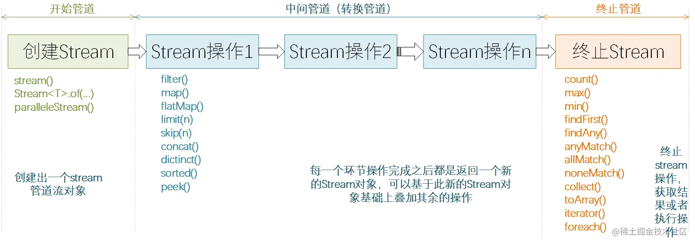

字符串列表去重计数

```java
package example;

import java.util.ArrayList;
import java.util.List;
import java.util.stream.Stream;

public class StringDistinctExample {

    public static void main(String[] args) {
        List<String> list = new ArrayList<>();

        list.add("武汉加油");
        list.add("中国加油");
        list.add("世界加油");
        list.add("世界加油");

        long distinctCount = -1;
        try (Stream<String> stream = list.stream();) {
            // 中间操作 去重
            Stream<String> distinctStream = stream.distinct();
            // 终端操作 终端方法
            distinctCount = distinctStream.count();
        }

        System.out.println(distinctCount);
    }

}

```

名字过滤器

```java
package example;

import java.util.ArrayList;
import java.util.List;

public class NameFilterExample {

    private static final String[] NAME_DATA = {
            "张伟", "王芳", "李明", "赵敏", "钱建国", "孙雅婷", "周宇", "吴雪", "郑阳", "王洋",
            "陈琳", "杨健", "刘慧", "黄强", "胡莉", "林宇", "程芳", "朱强", "徐静", "何婷",
            "孔浩", "曹磊", "曾倩", "吕波", "丁雪", "江波", "何文", "董慧", "洪霞", "叶峰",
            "武鹏", "尹萍", "黄华", "罗刚", "梁洁", "郑涛", "谢静", "韩明", "何秀英", "李建",
            "张霞", "吴斌", "刘雪", "王强", "李敏", "赵辉", "孙倩", "周鹏", "吴洁", "郑阳",
            "林峰", "杨柳", "梁伟", "朱丽", "刘鹏", "陈婷", "张波", "王倩", "李宇", "赵萌",
            "孙涛", "周霞", "吴健", "郑文", "王婷", "冯刚", "陈洁", "杨涛", "徐丽", "曹伟",
            "曾琳", "吕明", "丁倩", "江强", "何欣", "董勇", "洪萍", "叶磊", "武秀英", "尹峰",
            "黄雪", "罗杰", "梁萍", "郑刚", "谢倩", "韩涛", "何芳", "李伟", "张丽", "吴磊",
    };

    // 将 NAME_DATA 中，以周开头的元素放到新数组中
    public static void main(String[] args) {

        ArrayList<String> nameList = new ArrayList<>(List.of(NAME_DATA));

        ArrayList<String> list = new ArrayList<>();

        // 常规方法
        for (String name : NAME_DATA) {
            if (name.startsWith("周")) {
                list.add(name);
            }
        }
        System.out.println(list);

        list.clear();

        // 流
        nameList.stream().filter(name -> name.startsWith("周")).forEach(list::add);
        System.out.println(list);
    }


}

```

中间操作不会立即执行，只有等到终端操作的时候，流才开始真正地遍历，用于映射、过滤等。通俗点说，就是一次遍历执行多个操作，性能就大大提高了。


### 创建流

| API              | 功能说明                                         |
| ---------------- | ------------------------------------------------ |
| stream()         | 创建出一个新的stream串行流对象                   |
| parallelStream() | 创建出一个可并行执行的stream流对象               |
| Stream.of()      | 通过给定的一系列元素创建一个新的Stream串行流对象 |

如果是数组，可以使用 `Arrays.stream()` 或者 `Stream.of` 创建流

```java
package create;

import java.util.Arrays;
import java.util.stream.IntStream;
import java.util.stream.Stream;

public class ArrayStreamCreate {

    private final static int STREAM_ARRAY_SIZE = 1000;
    private final static int[] STREAM_ARRAY = new int[STREAM_ARRAY_SIZE];

    static {
        for (int i = 0 ; i < 1000 ; i ++ ) {
            STREAM_ARRAY[i] = i;
        }
    }

    /**
     *
     * 处理原始整数数据（int 类型）的流。它专门用于处理整数数据，因此在处理数值型数据时更加高效。
     * IntStream 提供了一些特定于整数数据的操作，例如求和、平均值、最大值、最小值等。这些操作在处理数值数据时非常有用。
     * 在 IntStream 中，整数数据是原始类型，不需要进行装箱（boxing）操作。这可以提高性能，尤其在大量数据处理时。
     *
     * @return
     */
    private static IntStream createStreamWithArraysStream() {
        return Arrays.stream(STREAM_ARRAY);
    }

    private static Stream<Integer> createStreamWithStreamOf() {
        return Stream.of(1, 2, 3, 4, 5, 6);
    }

    public static void main(String[] args) {
        System.out.println("=====  Arrays.stream(array) CREATE =====");
        try (IntStream stream = createStreamWithArraysStream()) {
            stream.forEach(System.out::println);
        }

        System.out.println("=====  Stream.of(array) CREATE =====");
        try (Stream<Integer> stream = createStreamWithStreamOf()) {
            stream.forEach(System.out::println);
        }

    }

}
```

如果是集合，可以直接调用 `Collection#stream()` 方法来创建流

```java
/**
 * Returns a sequential {@code Stream} with this collection as its source.
 *
 * <p>This method should be overridden when the {@link #spliterator()}
 * method cannot return a spliterator that is {@code IMMUTABLE},
 * {@code CONCURRENT}, or <em>late-binding</em>. (See {@link #spliterator()}
 * for details.)
 *
 * @implSpec
 * The default implementation creates a sequential {@code Stream} from the
 * collection's {@code Spliterator}.
 *
 * @return a sequential {@code Stream} over the elements in this collection
 * @since 1.8
 */
default Stream<E> stream() {
    return StreamSupport.stream(spliterator(), false);
}
```

```java
package create;

import java.util.*;
import java.util.stream.Stream;

public class CollectionStreamCreate {

    private static final int COLLECTION_DATA_SIZE = 1000;
    private static final Set<String> STRING_SET = new HashSet<>(COLLECTION_DATA_SIZE);
    private static final Queue<String> STRING_QUEUE = new LinkedList<>();

    static {
        for (int i = 0 ; i < COLLECTION_DATA_SIZE ; i ++ ) {
            STRING_SET.add("Set Item " + i);
        }
        for (int i = 0 ; i < COLLECTION_DATA_SIZE ; i ++ ) {
            STRING_QUEUE.add("Queue Item " + i);
        }
    }

    public static void main(String[] args) {

        Collection<String> setCollection = STRING_SET;
        Collection<String> queueCollection = STRING_QUEUE;

        try (
                final Stream<String> setStream = setCollection.stream();
                final Stream<String> queueStream = queueCollection.stream()
        ) {
            System.out.println("SET STREAM COUNT: " + setStream.count());
            System.out.println("QUEUE STREAM COUNT: " + queueStream.count());
        }


    }

}

```


如果在多线程环境下，可能需要调用 `Colleciton#parallelStream()`   或者 `Stream#parallel()` 创建并发流。可以使用 `Stream#sequential()` 将并发流转换为普通流使其强制保持顺序，或者使用 `Stream#forEachOrdered()`

### 操作流

Stream 提供了许多有用的操作流的方法

#### 过滤

使用 `filter(Predicate<? super T>)` 从流中筛选出我们需要的元素。

```java
public class NameFilter {

    public static void main(String[] args) {
        final ArrayList<String> list = new ArrayList<>();
        list.addAll(List.of("王力宏", "王一博", "王晨", "邵贵龙", "李芙蓉", "王媛", "大王叫我来巡山"));
        try (Stream<String> stream = list.stream()) {
             stream.filter(element -> element.contains("王")).forEach(System.out::println);
        }
    }

}
```
`filter(Predicate<? super T>)`  接收一个 `Predicate`。

```java
/**
 * Represents a predicate (boolean-valued function) of one argument.
 *
 * <p>This is a <a href="package-summary.html">functional interface</a>
 * whose functional method is {@link #test(Object)}.
 *
 * @param <T> the type of the input to the predicate
 *
 * @since 1.8
 */
@FunctionalInterface
public interface Predicate<T> {

    /**
     * Evaluates this predicate on the given argument.
     *
     * @param t the input argument
     * @return {@code true} if the input argument matches the predicate,
     * otherwise {@code false}
     */
    boolean test(T t);
    
    /** 其他逻辑运算方法 **/
}
```

`Predicate` 是 Java8 提供的一个函数式接口，接受一个参数返回一个布尔值，我们可以使用 Lambda  表达式传递给 `filter` 方法。

```java
<a unclosed stream instance>.filter(element -> element.contains("王");)	// 筛选出名字中带 "王" 的字符串
```

`forEach(Consumer)` 接受一个 `Consumer`。`Consumer` 是 Java8 提供的一个函数式接口，接受一个单输入参数且无返回值的方法。`类名/对象名::方法名` 是 Java8 引入的新语法。

```java
// 表示对流中每个元素作为参数调用 System.out.println
// 其中 System.out 是一个对象
<a unclosed stream instance>.forEach(System.out::println);
```

#### 映射

通过某些操作，将一个流中的元素转化成新的流中的元素。当前后元素是一对一关系时，使用 `map(Function)`。

```java
package map;

import entity.Person;

import java.util.HashSet;
import java.util.List;
import java.util.Set;
import java.util.stream.Collectors;
import java.util.stream.Stream;

public class UpdatePersonAgeMap {

    public static void main(String[] args) {
        HashSet<Person> set = new HashSet<>(List.of(
                new Person("Alice", 21),
                new Person("Bob", 30),
                new Person("Seaborn", 20)
        ));
        System.out.println("====================================== Data to be updated ======================================");
        System.out.println(set);
        Set<Person> updatedSet = null;
        try (final Stream<Person> stream = set.stream()) {
             updatedSet = stream.map(p -> new Person(p.getName(), p.getAge() + 5)).collect(Collectors.toSet());
        }
        System.out.println("====================================== Updated data (Age plus 5) ======================================");
        System.out.println(updatedSet);
    }

}

```

`Function` 是 Java8 提供的一个函数式接口，接受一个参数并返回一个对象，我们可以使用 Lambda  表达式传递给 `map` 方法。

当前后元素关系是一对多关系时，使用 `flatMap(Function)` 方法，`flat(Function)` 和 `flatMap(Function)` 对比如下

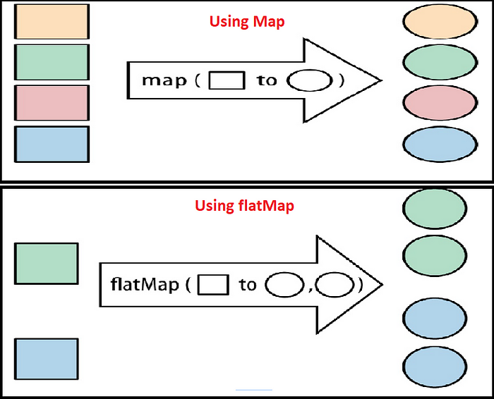

将若干句子拆分成一个单词列表

```java
package map;

import java.util.Arrays;
import java.util.List;
import java.util.stream.Collectors;
import java.util.stream.Stream;

public class SentenceSplitFlatMap {

    public static void main(String[] args) {

        List<String> sentences = List.of(
                "Hello world",
                "Java Stream API",
                "FlatMap example"
        );

        try (Stream<String> stream = sentences.stream()) {
            final List<String> words = stream.map(sentence -> sentence.split(" "))
                    .flatMap(Arrays::stream)
                    .collect(Collectors.toList());
            System.out.println(words);
        }
    }

}
```

将一个二维线性表扁平化为一维线性表

```java
package map;

import java.util.Collection;
import java.util.List;
import java.util.stream.Collectors;

public class FlatArrayFlatMap {

    public static void main(String[] args) {
        List<List<Integer>> listOfLists = List.of(
                List.of(1, 2, 3),
                List.of(4, 5, 6),
                List.of(7, 8, 9)
        );
        List<Integer> flatList = listOfLists.stream().flatMap(Collection::stream).collect(Collectors.toList());
        System.out.println(flatList);
    }

}

```

#### 匹配

`Stream` 接口提供了三个方法可供进行元素匹配，分别是

- `anyMatch(Predicate)`，只要有一个元素满足匹配条件就返回 true
- `allMatch(Predicate)`，只要有一个元素不满足匹配条件就返回  false
- `noneMatch(Predicate)`，只要有一个元素满足匹配条件就返回 false

姓名匹配

```java
package match;

import java.util.ArrayList;
import java.util.List;

public class NameMatch {

    public static void main(String[] args) {
        ArrayList<String> nameList = new ArrayList<>(List.of(
                "周杰伦",
                "王力宏",
                "陶喆",
                "林俊杰"
        ));
        // 查看列表中是否有任何一个姓王的姓名
        boolean anyWangSurname = nameList.stream().anyMatch(name -> name.startsWith("王"));
        System.out.println(anyWangSurname);

        // 查看列表是不是所有名字都是双字名
        boolean allDoubleName = nameList.stream().allMatch(name -> name.length() == 2);
        System.out.println(allDoubleName);

        // 查看列表中是否没有姓伍的姓名
        boolean noneWuSurname = nameList.stream().noneMatch(name -> name.startsWith("队伍"));
        System.out.println(noneWuSurname);

    }

}

```

偶数匹配

```java
package match;

import java.util.ArrayList;
import java.util.List;

public class NameMatch {

    public static void main(String[] args) {
        ArrayList<String> nameList = new ArrayList<>(List.of(
                "周杰伦",
                "王力宏",
                "陶喆",
                "林俊杰"
        ));
        // 查看列表中是否有任何一个姓王的姓名
        boolean anyWangSurname = nameList.stream().anyMatch(name -> name.startsWith("王"));
        System.out.println(anyWangSurname);

        // 查看列表是不是所有名字都是双字名
        boolean allDoubleName = nameList.stream().allMatch(name -> name.length() == 2);
        System.out.println(allDoubleName);

        // 查看列表中是否没有姓伍的姓名
        boolean noneWuSurname = nameList.stream().noneMatch(name -> name.startsWith("队伍"));
        System.out.println(noneWuSurname);

    }

}

```


#### 组合

`reduce` 的主要作用就是将 Stream 的元素组合起来，有两种用法。

`Optional<T> reduce(BinaryOperator)`

没有起始值，只有BinaryOperator 参数，表示一个二元操作，返回 `Optional`。

下面是一个例子，此时 reduce 返回空的 `Optional` 对象

```java
package reduce;

import java.util.List;
import java.util.Optional;

public class ReduceNullExample {

    public static void main(String[] args) {
        List<Integer> list = List.of();
        Optional<Integer> sum = list.stream().reduce(
                (x, y) -> x + y
        );
        if (sum.isPresent()) {
            System.out.println("SUMMATION: " + sum);	// 不会执行
        } else {
            System.out.println("列表为空，没有计算结果");
        }
    }

}
```

`T reduce(T identity , BinaryOperator)`

有起始值有 BinaryOperator 参数。此时返回类型和起始值类型一致。

求出列表中的最大值

```java
package reduce;

import java.util.ArrayList;

public class MaxNumberReduce {

    public static void main(String[] args) {
        ArrayList<Integer> numbers = new ArrayList<>();
        for (int i = 0 ; i < 10 ; i ++ ) {
            numbers.add(i);
        }
        int initialValue = Integer.MIN_VALUE;
        Integer maxValue = numbers.stream().reduce(initialValue, (x, y) -> x > y ? x : y);
        System.out.println("The max value of the list: " + maxValue);
    }

}
```

0 到 100 相加

```java
package reduce;

import java.util.ArrayList;
import java.util.List;

public class NumbersSummationReduce {

    private static List<Integer> list() {
        ArrayList<Integer> list = new ArrayList<>();
        for (int i = 0 ; i <= 100 ; i ++ ) {
            list.add(i);
        }
        return list;
    }

    public static void main(String[] args) {
        List<Integer> list = list();
        int summation = 0;
        Integer result = list.stream().reduce(summation, (x, y) -> {
            System.out.println("x = " + x + "; y = " + y);
            return x + y;
        });
        System.out.println(result);
    }

}

```

求平均值

```java
package reduce;

import java.util.ArrayList;
import java.util.Random;

public class AverageNumberReduce {

    private static final int SAMPLE_NUM = 100;

    public static void main(String[] args) {

        Random random = new Random();
        ArrayList<Double> scores = new ArrayList<>();
        for (int i = 0 ; i < SAMPLE_NUM ; i ++ ) {
            int append = random.nextInt(20) + 81;
            scores.add((double) append);
        }

        double initialValue = 0;
        System.out.println(scores.stream().reduce(initialValue, (x, y) -> (x + y / (double) SAMPLE_NUM)));

    }

}
```

#### 结果收集

结果收集主要使用 `collect(Collector)` 方法，在Java中，`java.util.stream.Collector`接口是用于将流中元素进行收集、聚合和归约操作的关键组件。允许将流的元素累积到一个可变结果容器中，从而生成一个最终结果。

1. `Supplier<A> supplier()`
2. `BiConsumer<A, T> accumulator()`
3. `BinaryOperator<A> combiner()`
4. `Function<A, R> finisher()`
5. `Set<Characteristics> characteristics()`

```java
package result;

import java.util.Collections;
import java.util.EnumSet;
import java.util.Set;
import java.util.function.BiConsumer;
import java.util.function.BinaryOperator;
import java.util.function.Function;
import java.util.function.Supplier;
import java.util.stream.Collector;

public class StringJoinCollector implements Collector<String, StringBuilder, String> {
    @Override
    public Supplier<StringBuilder> supplier() {
        return StringBuilder::new;
    }

    /**
     * accumulator() 方法用于将流中的元素逐个添加到中间结果容器中，适用于顺序流和并行流。
     */
    @Override
    public BiConsumer<StringBuilder, String> accumulator() {
        return StringBuilder::append;
    }

    /**
     * combiner() 方法用于在并行流操作中合并多个部分结果容器，只适用于并行流。
     */
    @Override
    public BinaryOperator<StringBuilder> combiner() {
        return StringBuilder::append;
    }

    @Override
    public Function<StringBuilder, String> finisher() {
        return StringBuilder::toString;
    }

    @Override
    public Set<Characteristics> characteristics() {
        return Collections.unmodifiableSet(EnumSet.of(Characteristics.IDENTITY_FINISH));
    }
}

```


##### 生成集合

统一收集某簇对象的某个属性

```java
package result;

import entity.Department;

import java.util.Arrays;
import java.util.List;
import java.util.Map;
import java.util.Set;
import java.util.stream.Collectors;

public class EntityIdCollect {

    public static void main(String[] args) {
        List<Department> list =
                Arrays.asList(new Department(17L), new Department(85L), new Department(100L), new Department(100L));

        // 1. collect 成 set
        Set<Long> idSet = list.stream().map(Department::getDeptId).collect(Collectors.toSet());
        System.out.println("idSet: " + idSet);

        // 2. collect 成 list
        List<Long> idList = list.stream().map(Department::getDeptId).collect(Collectors.toList());
        System.out.println("idList: " + idList);

        // 3. collect 成 map
        Map<Department, Long> idMap = list.stream().distinct().collect(Collectors.toMap(x -> x, Department::getDeptId));
        System.out.println(idMap);
    }

}

```

##### 字符串

自定义拼接字符串

```java
package result;

import java.util.Arrays;
import java.util.List;

public class StringJoinCollect {

    public static void main(String[] args) {
        List<String> list = Arrays.asList(
                "你好",
                "我好",
                "大家好"
        );
        String joinString = list.stream().collect(new StringJoinCollector());
        System.out.println(joinString);
    }

}

```

带分隔符地拼接字符串

```java
package result;

import java.util.Arrays;
import java.util.List;
import java.util.StringJoiner;
import java.util.stream.Collectors;

public class StringJoinWithDelimiterCollect {

    public static void main(String[] args) {
        List<String> list = Arrays.asList(
                "你好",
                "我好",
                "大家好"
        );
        // Collectors.joining(", ") 的底层是 StringJoiner
        String collect = list.stream().collect(Collectors.joining(", "));
        System.out.println(collect);
    }

}

```

##### 数据处理

`Collectors.averagingInt(map)`  和 `summarizingInt(map)`

```java
package result;

import java.util.Arrays;
import java.util.IntSummaryStatistics;
import java.util.List;
import java.util.stream.Collectors;

public class DataProcessCollect {

    public static void main(String[] args) {
        List<Integer> numbers = Arrays.asList(10, 20, 30, 40, 50);

        // 输出 element / 10 的平均值
        Double average = numbers.stream().collect(Collectors.averagingInt(value -> value / 10));
        System.out.println(average);

        // 输出 element / 2 的个数，总和，最小值，平均值，最大值
        IntSummaryStatistics statistic = numbers.stream().collect(Collectors.summarizingInt(n -> n / 2));
        System.out.println(statistic);

    }

}

```


### 练习

#### 计算列表中所有正整数的平均值

```java
package practice.primary;

import practice.RandomUtils;

import java.util.Collection;
import java.util.HashSet;
import java.util.stream.Collectors;

/**
 * 计算列表中所有正整数的平均值。
 */
public class PositiveIntegerAverage {

    private static Collection<Integer> collection() {
        HashSet<Integer> set = new HashSet<>();
        for (int i = 0 ; i < 10 ; i ++ ) {
            set.add(RandomUtils.randomInteger(80) * RandomUtils.randomSign());
        }
        return set;
    }

    public static void main(String[] args) {
        Collection<Integer> collection = collection();

        double average = collection.stream()
                .filter(element -> element > 0)                 // 筛选出正整数
                .mapToDouble(Integer::doubleValue)              // 将正整数转为双精度浮点数
                .average()                                      // 取其平均值，返回 OptionalDouble 对象
                .orElse(0.0)                              // 若 OptionalDouble isEmpty 取 0.0
                ;
        System.out.println(average);

        double averageBySummarizing = collection.stream().filter(element -> element > 0).collect(Collectors.summarizingInt(e -> e)).getAverage();
        System.out.println(averageBySummarizing);
    }

}

```

#### 将字符串列表转换为大写

```java
package practice.primary;

import java.util.Arrays;
import java.util.List;
import java.util.stream.Collectors;

/**
 * 将字符串列表转换为大写。
 */
public class StringTransferToUpperCase {

    private static List<String> words = Arrays.asList(
            "apple", "banana", "car", "dog", "elephant",
            "flower", "guitar", "house", "ice cream", "jacket",
            "kite", "lamp", "moon", "notebook", "orange",
            "pineapple", "queen", "rainbow", "sun", "tree"
    );

    public static void main(String[] args) {
        StringTransferToUpperCase.words.stream()
                .map(s -> s.toUpperCase())          // 一对一的全部转为大写
                .collect(Collectors.toList())       // 收集结果成集合
        ;
    }

}

```

#### 找出列表中的最大值和最小值。

```java
package practice.primary;

import practice.RandomUtils;

import java.util.Comparator;
import java.util.IntSummaryStatistics;
import java.util.List;
import java.util.Optional;
import java.util.stream.Collectors;

/**
 * 找出列表中的最大值和最小值。
 */
public class FindMinMaxInList {

    public static void main(String[] args) {
        List<Integer> list =
                RandomUtils.randomIntegerList(20, 21, 80);
        System.out.println(list);

        /* SUMMARIZING */
        System.out.println("/* SUMMARIZING */");
        IntSummaryStatistics statistics = list.stream().collect(Collectors.summarizingInt(element -> element));
        System.out.println("Min: " + statistics.getMax());
        System.out.println("Max: " + statistics.getMin());

        /* MAX, MIN */
        System.out.println("/* MAX, MIN */");
        Optional<Integer> min = list.stream().max(Comparator.comparingInt(x -> x));
        Optional<Integer> max = list.stream().min(Comparator.comparingInt(x -> x));
        System.out.println("Min: " + min.orElse(Integer.MAX_VALUE));
        System.out.println("Max: " + max.orElse(Integer.MIN_VALUE));
    }

}

```

#### 偶数筛

```java
package practice.primary;

import practice.RandomUtils;

import java.util.List;
import java.util.stream.Collectors;

/**
 * 从列表中筛选出所有偶数。
 */
public class EvenSieve {

    public static void main(String[] args) {
        List<Integer> list = RandomUtils.randomIntegerList(20, 80 + 1, 20);
        List<Integer> evenList = list.stream().filter(n -> (n & 1) == 0).collect(Collectors.toList());
        System.out.println("evenList: " + evenList);
    }

}

```

#### 找出列表中长度大于等于5的字符串

```java
package practice.primary;


import java.util.List;
import java.util.stream.Collectors;

/**
 * 找出列表中长度大于等于5的字符串
 */
public class LengthGreater5String {

    public static void main(String[] args) {
        List<String> list = List.of("apple", "banana", "kiwi", "grape", "orange");
        System.out.println(list.stream().filter(s -> s.length() >= 5).collect(Collectors.toList()));
    }

}

```

#### 将整数列表中的所有元素平方后生成新的列表

```java
package practice.primary;

import practice.RandomUtils;

import java.util.List;
import java.util.stream.Collectors;

/**
 * 将整数列表中的所有元素平方后生成新的列表
 */
public class IntegerSquare {

    public static void main(String[] args) {
        List<Integer> list =
                RandomUtils.randomIntegerList(20, 0, 40);

        List<Integer> squareList = list.stream().map(e -> e * e).collect(Collectors.toList());
        System.out.println(list);
        System.out.println(squareList);
    }

}

```


#### 将字符串列表按照长度排序

```java
package practice.primary;

import practice.RandomUtils;

import java.util.ArrayList;
import java.util.Comparator;
import java.util.List;
import java.util.stream.Collectors;

/**
 * 将字符串列表按照长度排序
 */
public class StringLengthSort {

    public static void main(String[] args) {
        List<String> list = new ArrayList<>();
        for (int i = 0 ; i < 10 ; i ++ ) {
            list.add(RandomUtils.generateRandomString());
        }
        List<String> sortedList = list.stream().sorted(Comparator.comparingInt(String::length)).collect(Collectors.toList());
        sortedList.forEach(System.out::println);
    }

}

```

#### 将两个整数列表合并为一个列表，然后去除重复元素

```java
package practice.primary;

import practice.RandomUtils;

import java.util.Collection;
import java.util.Comparator;
import java.util.List;
import java.util.stream.Collectors;
import java.util.stream.Stream;

/**
 * 将两个整数列表合并为一个列表，然后去除重复元素
 */
public class MergeIntegerList {

    public static void main(String[] args) {

        List<Integer> firstList = RandomUtils.randomIntegerList(20, 10, 10);
        List<Integer> secondList = RandomUtils.randomIntegerList(20, 10, 10);

        firstList.sort(Comparator.comparingInt(x -> x));
        secondList.sort(Comparator.comparingInt(x -> x));

        System.out.println("firstList = " + firstList);
        System.out.println("secondList = " + secondList);

        List<Integer> mergeDistinctList = 
                Stream.of(firstList, secondList).flatMap(Collection::stream).distinct().collect(Collectors.toList());
        System.out.println("mergeDistinctList = " + mergeDistinctList);

    }

}

```

#### 找出列表中第一个大于10的元素。

```java
package practice.intermediate;

import practice.RandomUtils;

import java.util.List;
import java.util.stream.Collectors;

/**
 * 找出列表中第一个大于10的元素。
 */
public class FirstGreater10Element {

    public static void main(String[] args) {
        // 生成一个包含 100 个随机整数的列表，范围在 0 到 20 之间
        List<Integer> list =
                RandomUtils.randomIntegerList(100, 0, 20);
        System.out.println(list);

        // 使用 takeWhile 方法获取满足条件的元素，直到遇到第一个不满足条件的元素，然后统计满足条件的元素个数
        long resultIndex = list.stream().takeWhile(integer -> integer <= 10).collect(Collectors.toList()).stream().count();

        // 输出满足条件的元素个数和第一个大于 10 的元素的值
        System.out.println("resultIndex: " + resultIndex + "; result: " + list.get((int) resultIndex));
    }

}

```

#### 计算列表中所有数字的乘积。

```java
package practice.intermediate;

import practice.RandomUtils;

import java.util.List;

/**
 * 计算列表中所有数字的乘积。
 */
public class AllNumberMultiplication {

    public static void main(String[] args) {
        List<Integer> list =
                RandomUtils.randomIntegerList(5, 1, 10);
        System.out.println(list);
        System.out.println(list.stream().mapToLong(x -> x).reduce(1L, (acc, x) -> acc * x));
    }

}

```


#### 将字符串列表中的元素连接成一个以逗号分隔的字符串	

```java
package practice.intermediate;

import practice.RandomUtils;

import java.util.List;
import java.util.stream.Collectors;

/**
 * 将字符串列表中的元素连接成一个以逗号分隔的字符串
 */
public class CommaDelimiterJoinString {

    public static void main(String[] args) {
        List<String> list =
                RandomUtils.generateRandomStringList(10);
        list.forEach(System.out::println);
        String commaJoinString = list.stream().collect(Collectors.joining(",\n"));
        System.out.println(commaJoinString);
    }

}

```

#### 找出列表中长度最长的字符串。

```java
package practice.intermediate;

import practice.RandomUtils;

import java.util.Comparator;
import java.util.List;

/**
 * 找出列表中长度最长的字符串。
 */
public class LengthMaxString {

    public static void main(String[] args) {
        List<String> list =
                RandomUtils.generateRandomStringList(10);
        String maxLengthString = list.stream().max(Comparator.comparingInt(String::length)).orElseThrow();
        System.out.println(maxLengthString);
    }

}

```

#### 将列表中的字符串按照字母顺序排序，并去除重复项。

```java
package practice.intermediate;

import java.util.ArrayList;
import java.util.List;
import java.util.stream.Collectors;

/**
 * 将列表中的字符串按照字母顺序排序，并去除重复项。
 */
public class StringDictionarySortDistinct {

    private static List<String> list() {
        List<String> strings = new ArrayList<>();
        strings.add("apple");
        strings.add("orange");
        strings.add("banana");
        strings.add("apple");
        strings.add("kiwi");
        strings.add("banana");
        return strings;
    }

    public static void main(String[] args) {
        List<String> list = list();
        List<String> distinctSortedStringList = list.stream().distinct().sorted().collect(Collectors.toList());
        System.out.println(distinctSortedStringList);
    }

}

```


#### 将整数列表分组，使得奇数和偶数分开。

```java
package practice.intermediate;

import practice.RandomUtils;

import java.util.List;
import java.util.Map;
import java.util.stream.Collectors;

/**
 * 将整数列表分组，使得奇数和偶数分开。
 */
public class EvenOddIntegerGroup {

    public static void main(String[] args) {
        List<Integer> list = RandomUtils.randomIntegerList(100, 20, 81);
        Map<Boolean, List<Integer>> evenOddGroupMap = list.stream().collect(Collectors.groupingBy(element -> ((element & 1) == 0)));
        evenOddGroupMap.entrySet().forEach(System.out::println);
    }

}

```


#### 找出列表中长度大于等于3的字符串，并将它们以逗号分隔的形式输出。

```java
package practice.intermediate;

import practice.RandomUtils;

import java.util.List;
import java.util.stream.Collectors;

/**
 * 找出列表中长度大于等于3的字符串，并将它们以逗号分隔的形式输出。
 */
public class StringLengthGreaterThan3CommaDelimiter {

    public static void main(String[] args) {
        List<String> list = RandomUtils.generateRandomStringList(100, 1, 10);
        String result = list.stream().filter(s -> s.length() > 3).collect(Collectors.joining(",\n"));
        System.out.println(result);
    }

}

```


#### 将字符串列表中的每个字符串的每个字符拆分成一个字符列表。

```java
package practice.intermediate;

import practice.RandomUtils;

import java.util.List;
import java.util.stream.Collectors;

/**
 * 将字符串列表中的每个字符串的每个字符拆分成一个字符列表。
 */
public class SplitStringListIntoCharList {

    public static void main(String[] args) {
        List<String> list = RandomUtils.generateRandomStringList(20);
        List<Character> letters = list.stream()
                .flatMapToInt(String::chars)        // 转为 IntStream
                .mapToObj(i -> (char) i)            // 转为 Stream<Character>
                .collect(Collectors.toList());      // 收集结果
        System.out.println(letters);
    }

}

```

#### 找出列表中所有的质数

```java
package practice.advanced;

import practice.RandomUtils;

import java.util.List;
import java.util.stream.Collectors;

public class FindPrimeNumber {

    public static void main(String[] args) {
        List<Integer> list = 
                RandomUtils.randomIntegerList(100, 20, 81);
        List<Integer> primeList = list.stream()
                .filter(FindPrimeNumber::prime)
                .collect(Collectors.toList());
        System.out.println(primeList);
    }

    private static boolean prime(int n) {
        if (n < 1) {
            return false;
        }
        if (n == 1) {
            return true;
        }
        for (int i = 2 ; i < Math.sqrt(n) ; i ++ ) {
            if (n % i == 0) {
                return false;
            }
        }
        return true;
    }

}

```

#### 统计列表中每个字符串中每个字符出现的次数

```java
package practice.advanced;

import practice.RandomUtils;

import java.util.List;
import java.util.Map;
import java.util.stream.Collectors;

/**
 * 统计列表中每个字符串中每个字符出现的次数
 */
public class StringCharacterCounter {

    public static void main(String[] args) {
        List<String> list = RandomUtils.generateRandomStringList(20);
        Map<Character, Long> map = list.stream().flatMap(s -> s.chars().mapToObj(c -> (char) c)).collect(
                Collectors.groupingBy(
                        c -> c,                 // 分类依据
                        Collectors.counting()   // 对分完类的各组继续进行操作
                )
        );
        System.out.println(map);
    }

}

```

#### 找出列表中长度最长的字符串的长度，使用reduce操作

```java
package practice.advanced;

import practice.RandomUtils;

import java.util.List;

/**
 * 找出列表中长度最长的字符串的长度，使用reduce操作
 */
public class FindLengthMaxStringByReduce {

    public static void main(String[] args) {
        List<String> list = RandomUtils.generateRandomStringList(100);
        String lengthMaxString = list.stream().reduce("", (acc, x) -> acc.length() > x.length() ? acc : x);
        System.out.println(lengthMaxString);
    }

}

```

#### 计算列表中所有数字的平方和，使用map和reduce操作

```java
package practice.advanced;

import practice.RandomUtils;

import java.util.List;

/**
 * 计算列表中所有数字的平方和，使用map和reduce操作
 */
public class SquareSumByMapAndReduce {

    public static void main(String[] args) {
        List<Integer> list =
                RandomUtils.randomIntegerList(5, 0, 10);
        System.out.println(list);
        long squareSummation = list.stream().mapToLong(x -> x).reduce(0L, (acc, x) -> acc + x * x);
        System.out.println(squareSummation);
    }

}

```


### 通过一个实例深入了解 Stream Collect

人员信息数据

| 姓名 | 子公司   | 部门     | 年龄 | 工资 |
| ---- | -------- | -------- | ---- | ---- |
| 大壮 | 上海公司 | 研发一部 | 28   | 3000 |
| 二牛 | 上海公司 | 研发一部 | 24   | 2000 |
| 铁柱 | 上海公司 | 研发二部 | 34   | 5000 |
| 翠花 | 南京公司 | 测试一部 | 27   | 3000 |
| 玲玲 | 南京公司 | 测试二部 | 31   | 4000 |

#### 现有集团内所有人员列表，需要从中筛选出上海子公司的全部人员

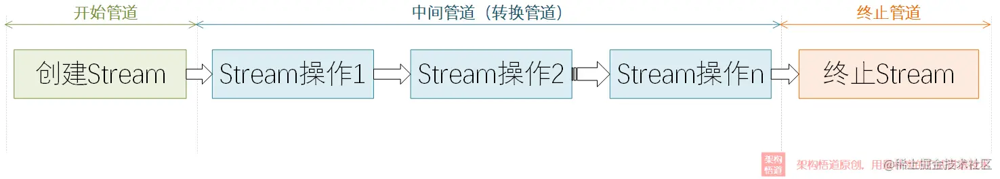

```java
/**
 * 现有集团内所有人员列表，需要从中筛选出上海子公司的全部人员
 */
public static List<Employee> filterEmployeesBySubCompany() {
    return employeeCollection().stream()
            .filter(employee -> "上海公司".equals(employee.getSubCompany()))
            .collect(Collectors.toList());
}
```

#### 现有集团内所有人员列表，需要从中筛选出上海子公司的全部人员，并按照部门进行分组

```java
/**
 * 现有集团内所有人员列表，需要从中筛选出上海子公司的全部人员，并按照部门进行分组
 */
public static Map<String, List<Employee>> filterEmployeeBySubCompanyAndDepartment() {
    return employeeCollection().stream()
            .filter(employee -> "上海公司".equals(employee.getSubCompany()))
            .collect(Collectors.groupingBy(Employee::getDepartment));
}
```

#### collect / Collector / Collectors 区别与联系

1. collect 是 Stream 流的一个终止方法，会使用传入的收集器对结果执行相关的操作，这个收集器必须是 Collector 接口的某个具体实现类
2. Collector 是一个接口，collect 方法的收集器是 Collector 接口的具体实现类
3. Collectors 是一个工具类，提供了很多静态工厂方法，为了方便开发时使用预置的较为通用的收集器（当然也可以自己实现 Collector）

Stream 结果收集的本质，就是将 Stream 中的元素通过收集器定义的函数处理逻辑进行加工吗，然后输出加工后的结果。

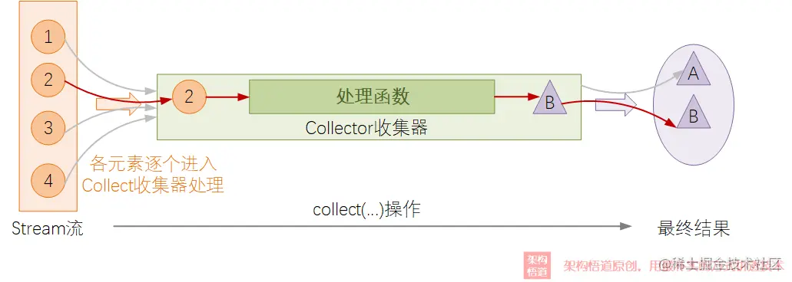

#### Collector 使用剖析

根据其执行的操作类型来划分，可将收集器分为几种不同的**大类**：

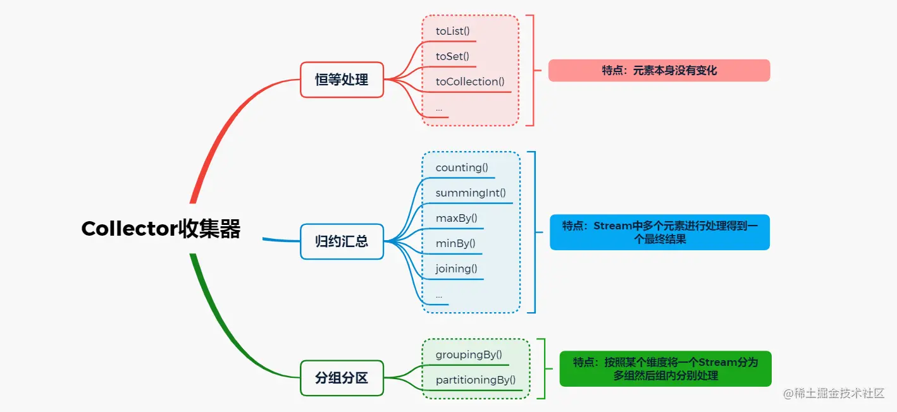

##### 恒等处理

所谓恒等处理就是指 Stream 的元素经过 Collector 函数处理前后完全不变，例如 `toList()` 操作，只是将最终结果从 Stream 取出并放入 List 对象中，并没有对元素本身进行任何处理

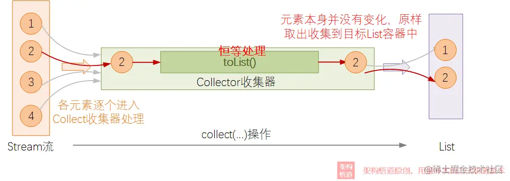

恒等处理类型的Collector是实际编码中**最常被使用**的一种。

##### 归约汇总

对于规约汇总的操作，Stream 流中的元素逐个遍历，进入到 Collector 处理函数中，然后会与上一个元素的处理结果进行合并处理，并得到一个新的结果，以此类推，直到遍历完成，得到最终结果。比如 `Collectors.summingInt()`，方法逻辑如下

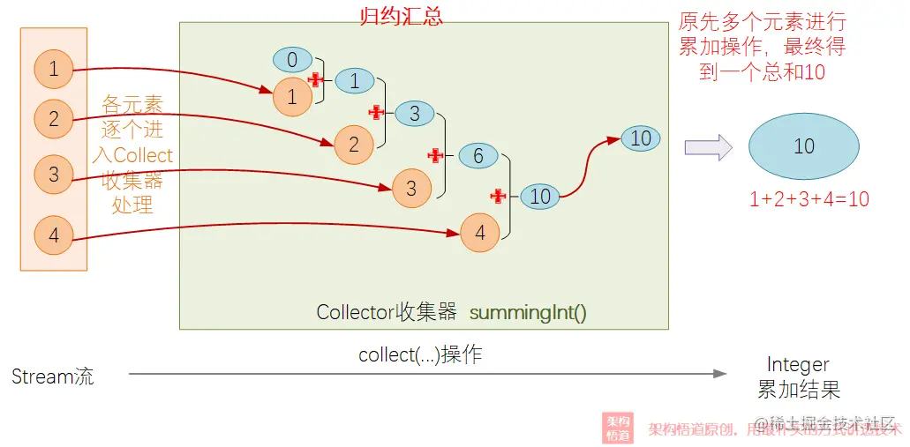

上例中，计算上海子公司每个月需要支付的员工工资

```java
/**
 * 计算上海子公司每个月需要支付的员工总工资
 */
private static int ShanghaiSubCompanySalarySum() {
    return employeeCollection().stream()
            .filter(employee -> "上海公司".equals(employee.getSubCompany()))
            .collect(Collectors.summingInt(employee -> employee.getSalary()));
}
```

##### 分组分区

**Collectors工具类**中提供了`groupingBy`方法用来得到一个分组操作Collector，其内部处理逻辑可以参见下图的说明：

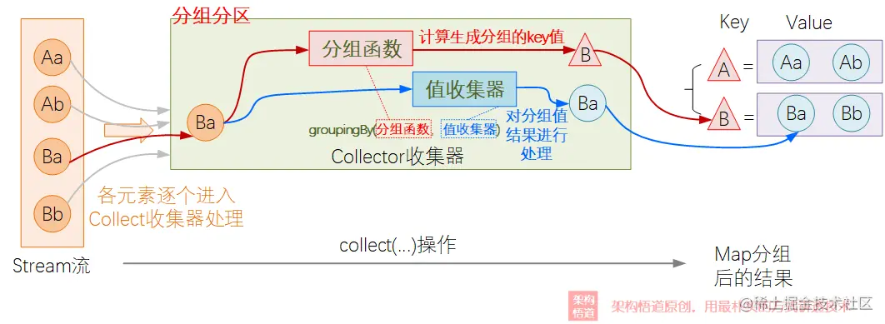

groupingBy() 需要传入两个参数，分组函数和值收集器

- 分组函数

  一个处理函数，基于指定的元素进行处理，返回一个用于分组的值，对于经过此函数处理后返回值相同的元素，将被分配到同一个组里。

- 值收集器

  对于分组后的数据元素做进一步处理转换逻辑，此处还是一个常规的 Collector 收集器

于 groupingBy() 分组函数和值收集器缺一不可，其中，值收集器默认为 toList()

```java
public static <T, K> Collector<T, ?, Map<K, List<T>>>
groupingBy(Function<? super T, ? extends K> classifier) {
    return groupingBy(classifier, toList());
}
```

按照子公司维度将员工分组（默认值收集器）

```java
/**
 * 按照子公司维度将员工分组
 */
private static Map<String, List<Employee>> groupBySubCompany() {
    return employeeCollection().stream()
            .collect(Collectors.groupingBy(Employee::getSubCompany))    // 值收集器默认为 toList()
            ;
}
```

而如果不仅需要分组，还需要对分组后的数据进行处理的时候，则需要同时给定分组函数以及值收集器：

按照子公司分组，并统计每个子公司的员工数

```java
/**
 * 按照子公司分组，统计每个子公司的员工数量
 */
private static Map<String, Long> groupBySubCompanyThenCount() {
    return employeeCollection().stream()
            .collect(
                    Collectors.groupingBy(
                            Employee::getSubCompany,
                            Collectors.counting()
                    )
            );
}
```

##### 叠加嵌套

collect 第二个参数类型是 Collector，故允许嵌套。

现有整个集团全体员工的列表，需要统计各子公司内各部门下的员工人数。

```java
/**
 * 现有整个集团全体员工的列表，需要统计各子公司内各部门下的员工人数。
 */
private static Map<String, Map<String, Long>> groupBySubCompanyAndSectionThenCount() {
    return employeeCollection().stream().collect(
            Collectors.groupingBy(
                    Employee::getSubCompany,
                    Collectors.groupingBy(
                            Employee::getDepartment,
                            Collectors.counting()
                    )
            ));
}
```

处理逻辑如下

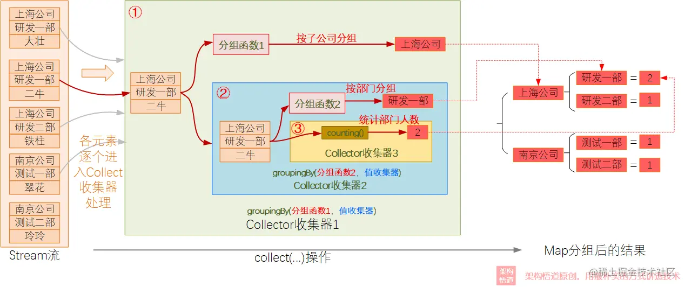

### Collectors 提供的值收集器

| 方法              | 含义说明                                                     |
| ----------------- | ------------------------------------------------------------ |
| toList            | 将流中的元素收集到一个List中                                 |
| toSet             | 将流中的元素收集到一个Set中                                  |
| toCollection      | 将流中的元素收集到一个Collection中                           |
| toMap             | 将流中的元素映射收集到一个Map中                              |
| counting          | 统计流中的元素个数                                           |
| summingInt        | 计算流中指定int字段的累加总和。针对不同类型的数字类型，有不同的方法，比如summingDouble等 |
| averagingInt      | 计算流中指定int字段的平均值。针对不同类型的数字类型，有不同的方法，比如averagingLong等 |
| joining           | 将流中所有元素（或者元素的指定字段）字符串值进行拼接，可以指定拼接连接符，或者首尾拼接字符 |
| maxBy             | 根据给定的比较器，选择出值最大的元素                         |
| minBy             | 根据给定的比较器，选择出值最小的元素                         |
| groupingBy        | 根据给定的分组函数的值进行分组，输出一个Map对象              |
| partitioningBy    | 根据给定的分区函数的值进行分区，输出一个Map对象，且key始终为布尔值类型 |
| collectingAndThen | 包裹另一个收集器，对其结果进行二次加工转换                   |
| reducing          | 从给定的初始值开始，将元素进行逐个的处理，最终将所有元素计算为最终的1个值输出 |

这里着重讲解 collectAndThen。collectAndThen 收集器必须先传入一个 downstream 收集器，再传入一个 finisher 方法。downstream 计算完成后，对 downstream 使用 finisher 抽取出我们真正想要的结果。

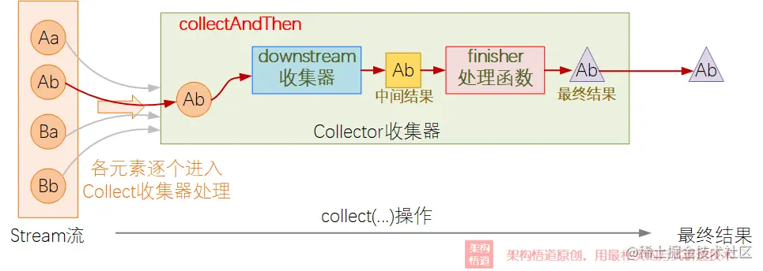

给定集团所有员工列表，找出上海公司中工资最高的员工。

```java
/**
 * 给定集团所有员工列表，找出上海公司中工资最高的员工。
 */
private static Employee findShanghaiHighestSalaryEmployee() {
    return employeeCollection().stream().filter(e -> "上海公司".equals(e.getSubCompany())).collect(
            Collectors.collectingAndThen(
                    Collectors.maxBy(Comparator.comparingInt(Employee::getSalary)),
                    Optional::orElseThrow
            )
    );
}
```

### 自定义收集器

上述例子中我们使用的都是 Collectors 工具类提供的收集器。但是有时，我们需要定制化的场景，现有收集器无法满足我们的诉求，此时可以自己实现自定义收集器。

#### Collector 接口

收集器是 Collector 接口的实现类。如果需要定制收集器，则需要先深入了解 Collector 接口。Collector 有 5 个接口：

| 接口名称        | 功能含义说明                                                 |
| --------------- | ------------------------------------------------------------ |
| supplier        | 创建新的结果容器，可以是一个容器，也可以是一个累加器实例，总之是用来存储结果数据的 |
| accumlator      | 元素进入收集器中的具体处理操作                               |
| finisher        | 当所有元素都处理完成后，在返回结果前的对结果的最终处理操作，当然也可以选择不做任何处理，直接返回 |
| combiner        | 各个子流的处理结果最终如何合并到一起去，比如并行流处理场景，元素会被切分为好多个分片进行并行处理，最终各个分片的数据需要合并为一个整体结果，即通过此方法来指定子结果的合并逻辑 |
| characteristics | 对此收集器处理行为的补充描述，比如此收集器是否允许并行流中处理，是否finisher方法必须要有等等，此处返回一个Set集合，里面的候选值是固定的几个可选项。 |

于 characteristics 的可选项，说明如下

| 取值            | 含义说明                                                     |
| --------------- | ------------------------------------------------------------ |
| UNORDERED       | 声明此收集器的汇总归约结果与Stream流元素遍历顺序无关，不受元素处理顺序影响 |
| CONCURRENT      | 声明此收集器可以多个线程并行处理，允许并行流中进行处理       |
| IDENTITY_FINISH | 声明此收集器的finisher方法是一个恒等操作，可以跳过           |

那么，Collector 是如何互相配合协作的呢？

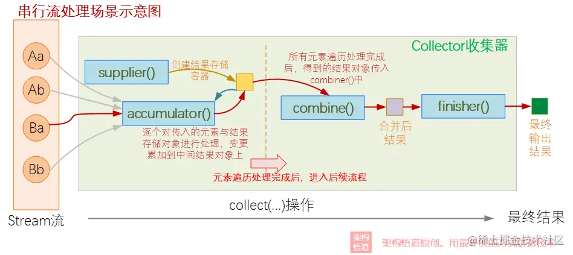

在并行场景下，先分片再多线程分片处理，最后合并

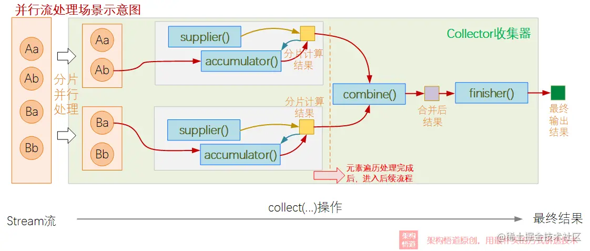

以 Collectors.toList() 为例，

```java
/**
 * Returns a {@code Collector} that accumulates the input elements into a
 * new {@code List}. There are no guarantees on the type, mutability,
 * serializability, or thread-safety of the {@code List} returned; if more
 * control over the returned {@code List} is required, use {@link #toCollection(Supplier)}.
 *
 * @param <T> the type of the input elements
 * @return a {@code Collector} which collects all the input elements into a
 * {@code List}, in encounter order
 */
public static <T>
Collector<T, ?, List<T>> toList() {
    return new CollectorImpl<>((Supplier<List<T>>) ArrayList::new, List::add,
                               (left, right) -> { left.addAll(right); return left; },
                               CH_ID);
}
```

- supplier：ArrayList::new，即创建一个 ArrayList 作为结果存储容器
- accumulator：List::add，对每个流中的元素作为方法入参执行 `List::add` 方法添加到结果容器
- combiner：(left, right) -> { left.addAll(right); return left; }。合并并行操作生成的各个子 ArrayList，最后通过 left.addAll(right) 合并为最终结果
- finisher：未提供，使用默认值 恒等操作
- characteristics：返回 IDENTITY_FINISH，也即最终结果直接返回，不使用 finisher 二次加工。注意没有声明 CONCURRENT，所以不支持并发。

#### 实现 Collector 接口

现有需求：计算流中每个元素的某个Integer字段值平方的总和，支持并发，使用收集器实现。

首先，Collector 接口是一个泛型接口

```java
public interface Collector<T, A, R> {
	// interface body...
}
```

T 表示输入的类型，A 表示存储累加容器的类型，R 表示结果类型。

输入类型为 Integer，存储累加容器类型为 AtomicInteger (支持并发)，结果类型为Integer。

##### supplier

创建一个结果存储累加的容器。既然我们要计算多个值的累加结果，那首先创建一个线程安全的 AtomicInteger存储一个累加结果。

```java
@Override
public Supplier<AtomicInteger> supplier() {
    return () -> new AtomicInteger(0);
}
```

##### accumulator

实现具体的积累计算逻辑，整个 Collector 的核心业务逻辑所在。累加遍历值的平方到累加容器。

```java
@Override
public BiConsumer<AtomicInteger, Integer> accumulator() {
    return (acc, current) -> {
        acc.addAndGet(current * current);
    };
}

```

##### combiner

并行流将 Stream 切片，再对分片进行合并，combiner 描述两个分片如何合并。

```java
@Override
public BinaryOperator<AtomicInteger> combiner() {
    return (firstSum, secondSum) -> {
        firstSum.addAndGet(secondSum.get());
        return firstSum;
    };
}
```

##### finisher

将存储累加容器转换为结果。使用 AtomicInteger::get 得到 Integer 类型的结果

```java
@Override
public Function<AtomicInteger, Integer> finisher() {
    return AtomicInteger::get;
}
```

##### characteristics

说明 Collector 收集器的一些特性：

1. 允许并行使用，声明 CONCURRENT 属性
2. 元素先后计算顺序无关，声明 UNORDERED 属性
3. finisher 方法对存储累加容器做了转换处理，并非恒等处理操作，所以不能声明 IDENTITY_FINISH

```java
@Override
public Set<Characteristics> characteristics() {
    return Collections.unmodifiableSet(
            EnumSet.of(
                    Characteristics.CONCURRENT,
                    Characteristics.UNORDERED
            )
    );
}
```

##### 测试

```java
package com.congee02.collector;

import java.util.List;

class ConcurrentSquareAdditionCollectorTest {

    public static void main(String[] args) {
        System.out.println(List.of(1, 2, 3, 4, 5).stream().collect(new ConcurrentSquareAdditionCollector()));
    }

}
```

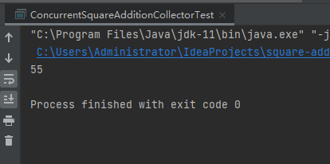

## :rocket: :first_quarter_moon:多线程


### 基本概念

#### 进程

进程是对运行时程序的封装，是系统进行资源调配和分配的基本单位，实现了操作系统的并发

#### 线程

是进程的子任务，是 CPU 调度和分派的基本单位，实现了进程内部的并发

#### 进程和线程

1. 线程在进程下进行
2. 进程之间不会互相影响，主线程结束，则整个进程结束
3. 不同的进程数据很难共享
4. 同进程下的不同线程之间数据很容易共享
5. 进程使用内存地址可以限定使用量

### 线程的创建

#### 继承 Thread 类，重写 run() 方法

```java
private static class CounterExtendThread extends Thread {

    public CounterExtendThread(String name) {
        super(name);
    }

    @Override
    public void run() {
        for (int i = 0 ; i < 10; i ++ ) {
            System.out.println(Thread.currentThread().getName() + " : " + i);
        }
    }

}
```

Thread 列表

```java
private static List<Thread> threads() {
    CounterExtendThread firstCounter =
            new CounterExtendThread("firstCounter");
    CounterExtendThread secondCounter =
            new CounterExtendThread("secondCounter");
    CounterExtendThread thirdCounter =
            new CounterExtendThread("thirdCounter");

    return List.of(
            firstCounter,
            secondCounter,
            thirdCounter
    );
}
```


##### 调用 Thread::run ThreadUtils#runThreads(List\<Thread\>)

```java
public static void runThreads(List<Thread> threads) {
    threads.forEach(Thread::run);
}
```


##### 调用 Thead::start ThreadUtils#startThreads(List\<Thread\>)

```java
public static void startThreads(List<Thread> threads) {
    threads.forEach(Thread::start);
}
```

##### 运行，观察区别

```java
public static void main(String[] args) {
    System.out.println("===== Thread::run =====");
    ThreadUtils.runThreads(threads());
    System.out.println("===== Thread::start =====");
    ThreadUtils.startThreads(threads());
}

```

##### 测试结果

```java
===== Thread::run =====
main : 0
main : 1
main : 2
main : 3
main : 4
main : 5
main : 6
main : 7
main : 8
main : 9
main : 0
main : 1
main : 2
main : 3
main : 4
main : 5
main : 6
main : 7
main : 8
main : 9
main : 0
main : 1
main : 2
main : 3
main : 4
main : 5
main : 6
main : 7
main : 8
main : 9
===== Thread::start =====
firstCounter : 0
firstCounter : 1
firstCounter : 2
secondCounter : 0
secondCounter : 1
firstCounter : 3
secondCounter : 2
thirdCounter : 0
secondCounter : 3
firstCounter : 4
secondCounter : 4
thirdCounter : 1
secondCounter : 5
firstCounter : 5
firstCounter : 6
firstCounter : 7
firstCounter : 8
firstCounter : 9
secondCounter : 6
thirdCounter : 2
thirdCounter : 3
thirdCounter : 4
thirdCounter : 5
thirdCounter : 6
thirdCounter : 7
thirdCounter : 8
secondCounter : 7
thirdCounter : 9
secondCounter : 8
secondCounter : 9
```


#### Thread::start 和 Thread::run 的区别

##### Thread::run

1. run() 方法定义在 Runnable 接口的实现类，描述线程的执行逻辑
2. 调用 run() 不会创建新的线程，而是在当前线程中直接执行 run() 方法。这会让代码逐个执行而不会真正实现并发
3. run() 方法在当前线程执行，无法充分利用多核处理器来实现并行计算

##### Thread::start

1. start() 方法定义在 Thread 类。通过继承 Thread 类并重写 run() 方法，可以创建一个新的进程，并在新线程上执行 run() 方法的代码
2. 调用 start() 方法会启动一个新的线程，并在该线程中执行 run() 方法。这样可以实现真正的并发执行，充分利用多核处理器
3. 注意，一个线程对象的 start() 方法只能调用一次，如果尝试多次调用，将会抛出 IllegalThreadStateException 异常

##### 总结

1. 执行 run() 方法会在当前线程中顺序执行，没有真正的并发
2. 使用 start() 方法会创建一个新线程，在新线程中并发执行 run() 方法的代码

通常情况下，推荐使用实现 Runnable 接口的方式来创建线程，因为它更灵活，允许将同一个 Runnable 实例传递给多个线程，从而实现更好的资源利用。使用 Thread 类限制了线程的继承关系，不够灵活 

#### 实现 Runnable 类，实现 run() 方法

```java
private static class CounterImplementRunnable implements Runnable {

    @Override
    public void run() {
        for (int i = 0 ; i <  10 ; i ++ ) {
            try {
                Thread.sleep(20);
            } catch (InterruptedException e) {
                e.printStackTrace();
            }
            System.out.println(Thread.currentThread().getName() + " : " + i);
        }
    }
}
```

实例化 Thread 时，使用 Thread(Runnable, String) 构造器

```java
private static List<Thread> threads() {
    return List.of(
            new Thread(new CounterImplementRunnable(), "firstCounter"),
            new Thread(new CounterImplementRunnable(), "secondCounter"),
            new Thread(new CounterImplementRunnable(), "thirdCounter")
    );
}
```

测试

```java
public static void main(String[] args) {
    System.out.println("===== Thread::run =====");
    ThreadUtils.runThreads(threads());
    System.out.println("===== Thread::start =====");
    ThreadUtils.startThreads(threads());
}
```

结果

```java
===== Thread::run =====
main : 0
main : 1
main : 2
main : 3
main : 4
main : 5
main : 6
main : 7
main : 8
main : 9
main : 0
main : 1
main : 2
main : 3
main : 4
main : 5
main : 6
main : 7
main : 8
main : 9
main : 0
main : 1
main : 2
main : 3
main : 4
main : 5
main : 6
main : 7
main : 8
main : 9
===== Thread::start =====
firstCounter : 0
secondCounter : 0
firstCounter : 1
secondCounter : 1
firstCounter : 2
firstCounter : 3
firstCounter : 4
firstCounter : 5
secondCounter : 2
secondCounter : 3
secondCounter : 4
secondCounter : 5
firstCounter : 6
secondCounter : 6
thirdCounter : 0
secondCounter : 7
firstCounter : 7
secondCounter : 8
thirdCounter : 1
secondCounter : 9
firstCounter : 8
thirdCounter : 2
firstCounter : 9
thirdCounter : 3
thirdCounter : 4
thirdCounter : 5
thirdCounter : 6
thirdCounter : 7
thirdCounter : 8
thirdCounter : 9
```


#### 实现 Callable 接口，重写 run() 方法，支持 FutureTask

```java
package com.congee02.multithread.create;

import java.util.concurrent.Callable;
import java.util.concurrent.ExecutionException;
import java.util.concurrent.FutureTask;

public class CreateSquareCalculatorThreadByImplementCallable {

    private static class SquareCalculator implements Callable<Integer> {

        private int number;

        public SquareCalculator(int number) {
            this.number = number;
        }

        @Override
        public Integer call() throws Exception {
            Thread.sleep(1000L);
            return number * number;
        }
    }

    public static void main(String[] args) {
        FutureTask<Integer> task = new FutureTask<>(new SquareCalculator(20));
        new Thread(task).start();
        try {
            Integer result = task.get();
            System.out.println(result);
        } catch (InterruptedException | ExecutionException e) {
            e.printStackTrace();
        }
    }

}

```


### 控制当前线程

线程控制有三个常见的方法 sleep(long), join(), setDaemon(boolean)

#### sleep(long)

当前线程暂停指定毫秒数，进入休眠状态

```java
package com.congee02.multithread.control;

public class ThreadSleep {

    public static void main(String[] args) {
        try {
            Thread.sleep(200);
        } catch (InterruptedException e) {
            e.printStackTrace();
        }
    }

}
```


#### join()

执行后，当前线程执行完毕后，后续线程才能得到 CPU 的执行权。

```java
package com.congee02.multithread.control;

import java.util.Random;

public class ThreadJoin {

    public static void main(String[] args) {
        Random random = new Random();
        Runnable count = () -> {
            for (int i = 0; i < 5; i++) {
                try {
                    Thread.sleep(random.nextInt(10));
                } catch (InterruptedException e) {
                    e.printStackTrace();
                }
                System.out.println(Thread.currentThread().getName() + " : " + i);
            }
        };

        Thread joinThread = new Thread(count, "Join Thread");
        joinThread.start();
        try {
            joinThread.join();
        } catch (InterruptedException e) {
            e.printStackTrace();
        }

        System.out.println("===== Join Thread End =====");

        Thread t1 = new Thread(count, "Normal Thread " + 1);
        Thread t2 = new Thread(count, "Normal Thread " + 2);
        Thread t3 = new Thread(count, "Normal Thread " + 3);

        t1.start();
        t2.start();
        t3.start();
    }

}

```

执行结果

```java
Join Thread : 0
Join Thread : 1
Join Thread : 2
Join Thread : 3
Join Thread : 4
===== Join Thread End =====
Normal Thread 3 : 0
Normal Thread 1 : 0
Normal Thread 1 : 1
Normal Thread 2 : 0
Normal Thread 2 : 1
Normal Thread 3 : 1
Normal Thread 1 : 2
Normal Thread 1 : 3
Normal Thread 1 : 4
Normal Thread 2 : 2
Normal Thread 3 : 2
Normal Thread 2 : 3
Normal Thread 2 : 4
Normal Thread 3 : 3
Normal Thread 3 : 4
```


#### setDaemon(boolean)

将线程标记为守护线程，用来服务其他的线程。 Java 中的垃圾回收线程，就是典型的守护线程。

守护线程主要用于 系统服务、定期任务和周期性操作、资源管理和监控、垃圾回收、后台日志记录、时间处理、自动化任务等等。	

```java
package com.congee02.multithread.control;

public class ThreadSetDaemon {

    public static void main(String[] args) {
        Thread loggerDaemon = loggerDaemon();
        loggerDaemon.start();

        try {
            Thread.sleep(10000);
        } catch (InterruptedException e) {
            e.printStackTrace();
        }

    }

    private static Thread loggerDaemon() {
        Thread thread = new Thread(logger());
        thread.setDaemon(true);
        return thread;
    }

    private static Runnable logger() {
        return () -> {
            try {
                int count = 1;
                while (true) {
                    System.out.println("Logging entry " + count ++);
                    Thread.sleep(1000);
                }
            } catch (InterruptedException e) {
                e.printStackTrace();
            }
        };
    }

}

```

##### 与普通线程相比，守护线程有如下特点

1. 终止行为
   - 普通线程：普通线程的终止不会影响程序的继续执行，即使所有的普通进程已经停止，程序仍然会继续运行，知道所有线程执行完成。
   - 守护线程：守护线程的终止会随着程序的终止而终止，即使守护线程的任务尚未完成。当所有的非守护线程都已经终止时，守护线程会被强制终止。
2. 执行任务
   - 普通线程：普通线程会阻止程序的继续执行，直到它们完成任务
   - 守护线程：守护线程在后台默默执行，不阻塞主程序的执行

总的来说，守护线程和普通线程之间的最大区别在于它们的终止行为和对主程序终止的影响。

### 线程的生命周期

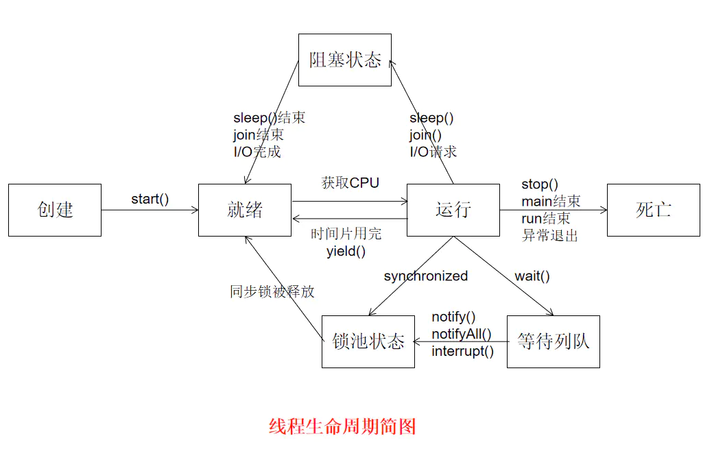

### 获取线程执行结果

在上述三种创建线程的方式（继承Thread、实现 Runnable、实现 Callable）中。前两种方式若要获取执行结果，必须通过共享变量或者线程通信的方式来达到目的，使用起来比较麻烦。

Java 提供了 Callable、Future、FutureTask，允许在任务执行后获取执行结果。

#### Callable 和  Runnable

Runnable::run() 方法返回值为 void，所以执行完任务后无法返回任何结果。

````java
@FunctionalInterface
public interface Runnable {
    /**
     * When an object implementing interface <code>Runnable</code> is used
     * to create a thread, starting the thread causes the object's
     * <code>run</code> method to be called in that separately executing
     * thread.
     * <p>
     * The general contract of the method <code>run</code> is that it may
     * take any action whatsoever.
     *
     * @see     java.lang.Thread#run()
     */
    public abstract void run();
}

````


Callable::call() 方法返回的是一个泛型类，有返回结果。

```java
@FunctionalInterface
public interface Callable<V> {
    /**
     * Computes a result, or throws an exception if unable to do so.
     *
     * @return computed result
     * @throws Exception if unable to compute a result
     */
    V call() throws Exception;
}
```

当我们需要使用 Callable 获取线程执行的结果时，我们需要配合 ExecutorService 和 Future 来使用。

```java
package com.congee02.multithread.reuslt;

import java.util.ArrayList;
import java.util.concurrent.*;

public class CallableGetExecuteResult {

    private final static int TASK_NUM = 10;

    public static void main(String[] args) {

        // 创建一个包含五个线程的线程池
        ExecutorService executorService = Executors.newFixedThreadPool(5);

        // 创建一个 Callable 任务
        Callable<String> task = () -> "Hello from " + Thread.currentThread().getName();

        // 提交任务到 ExecutorService 对象中执行，获取 Future 对象
        ArrayList<Future<String>> futures = new ArrayList<>(TASK_NUM);
        for (int i = 0 ; i < TASK_NUM ; i ++ ) {
            futures.add(executorService.submit(task));
        }

        // 通过 Future 获取任务结果
        futures.stream().map(future -> {
            try {
                return future.get();
            } catch (InterruptedException | ExecutionException e) {
                e.printStackTrace();
            }
            return null;
        }).forEach(System.out::println);

        // 关闭 ExecutorService 对象，不再接受新的任务，等待所有已提交的任务完成
        executorService.shutdown();
    }
}

```


##### ExecutorService

ExecutorService 是 Java 并发库中的一个接口，提供了管理和控制线程池的功能，使得在多线程下可以更加方便地管理任务的执行。通过使用 ExecutorService，允许将任务提交给线程池，并由线程池管理线程的创建、执行、复用以及资源的管理。

常用的 ExecutorService 实现类

1. Executors.newFixedThreadPool(int nThreads)

   创建一个固定大小的线程池，池中包含指定数量的线程。

2. Executors.newCachedThreadPool()

   创建一个缓存线程池，线程数量根据需要自动调整。适用于任务数不确定且执行时间较短的场景

3. Executors.newSingleThreadExecutor()

   创建一个单线程的线程池，适用于需要保证任务按顺序执行的情况。

4. Executors.newScheduledThreadPool(int corePoolSize)

##### Future

Future 是 Java 并发库中的一个接口，它表示一个异步运算的结果。可以在提交任务后获取任务的执行的结果、取消任务执行、查询任务状态等，有五个方法：

1. **`boolean cancel(boolean mayInterruptIfRunning)`**: 尝试取消任务的执行。`mayInterruptIfRunning` 参数表示是否允许中断正在执行的任务。
2. **`boolean isCancelled()`**: 检查任务是否已被取消。
3. **`boolean isDone()`**: 检查任务是否已经完成（不管是正常完成、取消还是抛出异常）。
4. **`V get()`**: 获取任务的执行结果，如果任务未完成，则阻塞等待直到任务完成。
5. **`V get(long timeout, TimeUnit unit)`**: 获取任务的执行结果，但最多等待指定的时间，如果在指定时间内任务仍未完成，则抛出 `TimeoutException`。

##### FutureTask

FutureTask 是 Future 接口唯一的实现类。在前面的例子中，executorService.submit(task) 返回的就是 FutureTask 类型的对象。

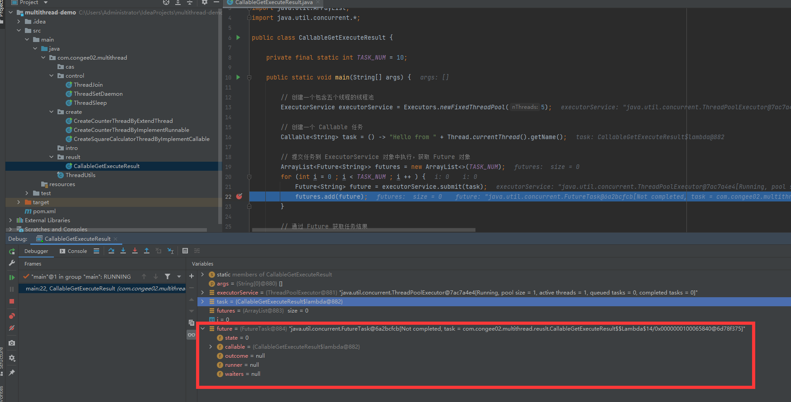

FutureTask 实现的接口

```java
public class FutureTask<V> implements RunnableFuture<V> {
	// class body ...
}
```

再看 RunnableFuture

```java
public interface RunnableFuture<V> extends Runnable, Future<V> {
    /**
     * Sets this Future to the result of its computation
     * unless it has been cancelled.
     */
    void run();
}
```

RunnableFuture 继承了 Runnable 和 Future，所以既可以作为 Runnable 被线程执行，又可以作为 Future 得到 Callable 的返回值

又一个示例

```java
package com.congee02.multithread.reuslt;

import java.util.ArrayList;
import java.util.concurrent.*;

public class CallableGetExecuteComputationResult {

    private static final int CALLABLE_TASK_NUM = 5;

    public static void main(String[] args) {

        // 固定大小的线程池
        ExecutorService executorService = Executors.newFixedThreadPool(3);

        // 创建 FutureTask 任务
        ArrayList<FutureTask<Integer>> tasks = new ArrayList<>(CALLABLE_TASK_NUM);
        for (int i = 0 ; i < CALLABLE_TASK_NUM ; i ++ ) {
            int index = i;
            tasks.add(new FutureTask<>(() -> {
                TimeUnit.SECONDS.sleep(index);
                return (index + 1) * 100;
            }));
        }

        // 提交 FutureTask 任务到 executorService
        tasks.forEach(executorService::submit);

        // 打印任务结果
        tasks.stream().map(task -> {
            try {
                return task.get();
            } catch (InterruptedException | ExecutionException e) {
                e.printStackTrace();
            }
            return null;
        }).forEach(System.out::println);

        // 关闭线程池
        executorService.shutdown();
    }

}

```

### Java 线程的六种状态及其切换

#### 操作系统线程

在操作系统中，线程被看作是轻量级的进程，所以操作系统的线程状态和操作系统的进程状态是一致的。


操作系统的线程主要有以下三个状态：

- 就绪状态

  线程正在等待使用 CPU，经调度程序之后进入 running 状态

- 执行状态

  线程正在使用 CPU

- 等待状态

  线程经过等待事件的调用或者等待其他资源（比如 I/O）

#### Java 线程

现在来看  Java 线程的 6 个状态

```java
public enum State {
    /**
     * Thread state for a thread which has not yet started.
     */
    NEW,

    /**
     * Thread state for a runnable thread.  A thread in the runnable
     * state is executing in the Java virtual machine but it may
     * be waiting for other resources from the operating system
     * such as processor.
     */
    RUNNABLE,

    /**
     * Thread state for a thread blocked waiting for a monitor lock.
     * A thread in the blocked state is waiting for a monitor lock
     * to enter a synchronized block/method or
     * reenter a synchronized block/method after calling
     * {@link Object#wait() Object.wait}.
     */
    BLOCKED,

    /**
     * Thread state for a waiting thread.
     * A thread is in the waiting state due to calling one of the
     * following methods:
     * <ul>
     *   <li>{@link Object#wait() Object.wait} with no timeout</li>
     *   <li>{@link #join() Thread.join} with no timeout</li>
     *   <li>{@link LockSupport#park() LockSupport.park}</li>
     * </ul>
     *
     * <p>A thread in the waiting state is waiting for another thread to
     * perform a particular action.
     *
     * For example, a thread that has called {@code Object.wait()}
     * on an object is waiting for another thread to call
     * {@code Object.notify()} or {@code Object.notifyAll()} on
     * that object. A thread that has called {@code Thread.join()}
     * is waiting for a specified thread to terminate.
     */
    WAITING,

    /**
     * Thread state for a waiting thread with a specified waiting time.
     * A thread is in the timed waiting state due to calling one of
     * the following methods with a specified positive waiting time:
     * <ul>
     *   <li>{@link #sleep Thread.sleep}</li>
     *   <li>{@link Object#wait(long) Object.wait} with timeout</li>
     *   <li>{@link #join(long) Thread.join} with timeout</li>
     *   <li>{@link LockSupport#parkNanos LockSupport.parkNanos}</li>
     *   <li>{@link LockSupport#parkUntil LockSupport.parkUntil}</li>
     * </ul>
     */
    TIMED_WAITING,

    /**
     * Thread state for a terminated thread.
     * The thread has completed execution.
     */
    TERMINATED;
}
```

##### NEW

处于 NEW 状态的线程此时尚未启动。这里的“尚未启动”指线程对象尚未调用 start 方法

```java
package com.congee02.multithread.state;

public class ThreadNewState {

    public static void main(String[] args) {
        // 创建线程，但尚未启动 (start 方法)，此时线程处于 NEW 状态
        Thread thread = new Thread(() -> {});
        System.out.println(thread.getState());
    }

}

```

上述线程创建但未启动线程，处于 NEW 状态

###### 能否反复调用一个线程的 start 方法

要回答这个问题，需要查看 Thread 的 start 方法源码

```java
/**
 * Causes this thread to begin execution; the Java Virtual Machine
 * calls the {@code run} method of this thread.
 * <p>
 * The result is that two threads are running concurrently: the
 * current thread (which returns from the call to the
 * {@code start} method) and the other thread (which executes its
 * {@code run} method).
 * <p>
 * It is never legal to start a thread more than once.
 * In particular, a thread may not be restarted once it has completed
 * execution.
 *
 * @throws     IllegalThreadStateException  if the thread was already started.
 * @see        #run()
 * @see        #stop()
 */
public synchronized void start() {
    /**
     * This method is not invoked for the main method thread or "system"
     * group threads created/set up by the VM. Any new functionality added
     * to this method in the future may have to also be added to the VM.
     *
     * A zero status value corresponds to state "NEW".
     */
    if (threadStatus != 0)
        throw new IllegalThreadStateException();

    /* Notify the group that this thread is about to be started
     * so that it can be added to the group's list of threads
     * and the group's unstarted count can be decremented. */
    group.add(this);

    boolean started = false;
    try {
        start0();
        started = true;
    } finally {
        try {
            if (!started) {
                group.threadStartFailed(this);
            }
        } catch (Throwable ignore) {
            /* do nothing. If start0 threw a Throwable then
              it will be passed up the call stack */
        }
    }
}
```

关键在于最开始的 if 条件判断

```java
if (threadStatus != 0)
        throw new IllegalThreadStateException();
```

其中 0 指代 Thread 的 NEW 状态。那么，如果当前线程对象的状态不是 NEW，也无法重现转变到 NEW 状态，此时尝试调用 start() 时，会抛出 IllegalThreadStateException。

当线程刚创建再第一次启动（调用 start()方法）后，状态不再为 NEW，那么再次调用时，会抛出 IllegalThreadState 异常。故曰：线程只能启动一次。

##### RUNNABLE

表示当前线程正在运行中。处于 RUNNABLE 状态的线程在 Java 虚拟机中运行，也有可能在等待 CPU 分配资源。

需要注意，Java 线程 的 RUNNABLE 包括了操作系统线程的 ready 和 running 两个状态。 

##### BLOCKED

阻塞状态。处于 BLOCKED 状态的线程正等待锁的释放以进入同步区。

```java
package com.congee02.multithread.state;

public class ThreadBlockedState {

    // 锁 同步区
    private final static Object resource = new Object();
    private final static Runnable getLockAndRun = () -> {
        // 尝试得到锁。若锁被占用，等待锁被释放，在此期间线程等待资源，状态为 BLOCK
        synchronized (resource) {
            System.out.println(Thread.currentThread().getName() + ": Holding the lock...");
            try {
                Thread.sleep(10000);
            } catch (InterruptedException e) {
                e.printStackTrace();
            }
            System.out.println(Thread.currentThread().getName() + ": Release the lock...");
        }

    };

    public static void main(String[] args) throws InterruptedException {
        Thread t1 = new Thread(getLockAndRun, "Thread1");
        t1.start();
        Thread t2 = new Thread(getLockAndRun, "Thread2");
        t2.start();
        while (t2.getState() != Thread.State.TERMINATED) {
            System.out.println("Thread2 state: " + t2.getState());
            Thread.sleep(1000); // 增加适当的延迟
        }
        System.out.println(t2.getState());
    }

}

```


##### WAITING

等待状态。处于等待状态的线程转为 RUNNABLE 状态需要其他线程唤醒。

调用三个方法会使得线程进入等待状态：

- Object#wait()

  使当前线程处于等待状态，直到被另一个线程唤醒

  生产者-消费者问题

  ```java
  package com.congee02.multithread.wait;
  
  public class ProducerConsumer {
  
      private static final Object lock = new Object();
      private static Runnable produce = () -> {
          synchronized (lock) {
              System.out.println("Producer: Producing data...");
              try {
                  lock.wait();
              } catch (InterruptedException e) {
                  e.printStackTrace();
              }
              System.out.println("Producer: Resumed");
          }
      };
  
      private static Runnable consume = () -> {
          synchronized (lock) {
              System.out.println("Consumer: Waiting for data...");
              try {
                  Thread.sleep(2000);
              } catch (InterruptedException e) {
                  e.printStackTrace();
              }
              lock.notify();
          }
      };
  
      public static void main(String[] args) {
          Thread producer = new Thread(produce);
          Thread consumer = new Thread(consume);
  
          producer.start();
          consumer.start();
  
          try {
              producer.join();
              consumer.join();
          } catch (InterruptedException e) {
              e.printStackTrace();
          }
  
      }
  
  }
  
  ```

- Thread#join()

  等待线程执行完毕，底层是调用 Object 实例的 wait 方法

- LockSupport#park()

##### TIMED_WAITING

超时等待状态。线程等待一个具体的时间，时间到后会被自动唤醒。

调用下列方法会使得线程进入超时等待状态：

- Thread#sleep(long millis)
- Object#wait(long timeout)
- Thread#join(long millis)
- LockSupport#parkNanos(long nanos)
- LockSupport#parkUntil(long deadline)

###### TIMED_WAITING 和 WAITING 的区别

1. TIMED_WAITING（计时等待）

   当线程使用  Thread#sleep(long millis) 方法、Object#wait(long timeout) 方法或者其他类似带有超时参数的等待方法且参数为正整数时，线程会进入 TIMED_WATING 状态；当其参数为0时，依然进入到 WAITING 状态。这表示线程在等待一段时间后会自动恢复到 RUNNABLE 状态。例如，Thread.sleep(1000) 会使当前进程进入到 TIMED_WATING 状态，持续 1 秒后，恢复到  RUNNABLE 状态。

2.  WAITING（无限等待）

   当线程使用 Object#wait() 方法，Thread#join() 等方法，线程进入 WAITING 状态。在此状态下，线程会一直等待某个条件满足，直到其他线程显示地唤醒它。

##### TERMINATED

终止状态，此时线程已经执行完毕。


#### Java 线程 状态转换


##### BLOCKED 与 RUNNABLE 状态的转换

处于 BLOCKED 状态的线程是因为在等待锁的释放。有两个线程 t1 和 t2，t1 提前获得了锁并且暂未释放，此时 t2 处于 BLOCKED 状态。

```java
package com.congee02.multithread.state;

public class ThreadBlockedState {

    // 锁 同步区
    private final static Object resource = new Object();
    private final static Runnable getLockAndRun = () -> {
        // 尝试得到锁。若锁被占用，等待锁被释放，在此期间线程等待资源，状态为 BLOCK
        synchronized (resource) {
            System.out.println(Thread.currentThread().getName() + ": Holding the lock...");
            try {
                Thread.sleep(10000);
            } catch (InterruptedException e) {
                e.printStackTrace();
            }
            System.out.println(Thread.currentThread().getName() + ": Release the lock...");
        }

    };

    public static void main(String[] args) throws InterruptedException {
        Thread t1 = new Thread(getLockAndRun, "Thread1");
        t1.start();
        Thread t2 = new Thread(getLockAndRun, "Thread2");
        t2.start();
        while (t2.getState() != Thread.State.TERMINATED) {
            Thread.sleep(1000); // 增加适当的延迟
            System.out.println("Thread2 state: " + t2.getState());
        }
        System.out.println(t2.getState());
    }

}

```

 结果

```java
Thread1: Holding the lock...
Thread2 state: BLOCKED
Thread2 state: BLOCKED
Thread2 state: BLOCKED
Thread2 state: BLOCKED
Thread2 state: BLOCKED
Thread2 state: BLOCKED
Thread2 state: BLOCKED
Thread2 state: BLOCKED
Thread2 state: BLOCKED
Thread1: Release the lock...
Thread2: Holding the lock...
Thread2 state: TIMED_WAITING
Thread2 state: TIMED_WAITING
Thread2 state: TIMED_WAITING
Thread2 state: TIMED_WAITING
Thread2 state: TIMED_WAITING
Thread2 state: TIMED_WAITING
Thread2 state: TIMED_WAITING
Thread2 state: TIMED_WAITING
Thread2 state: TIMED_WAITING
Thread2 state: TIMED_WAITING
Thread2: Release the lock...
Thread2 state: TERMINATED
TERMINATED
```

##### WAITING 与 RUNNABLE 的转换

有三种方法将线程的状态从 RUNNABLE 转换为 WAITING 状态，下面主要介绍 Object#wait() 和 Thread#join()。

1. Object#wait()

   一个线程调用锁的 wait() 方法前，线程必须持有该对象的锁。

   线程使用 wait() 方法时，会释放当前的锁，直到有其他线程调用 notify( ) / notifyAll() 方法唤醒

   简单的 Producer-Consumer 问题

   ```java
   package com.congee02.multithread.wait;
   
   
   public class ProducerConsumer {
   
       // 锁
       private static final Object lock = new Object();
   
       // 生产者逻辑
       private static Runnable produce = () -> {
           // 尝试获取锁
           synchronized (lock) {
               System.out.println("Producer: Producing data...");
               try {
                   // 生产者已经生产数据，等待消费者消费。
                   // 暂时释放锁，等待消费者使用 lock.notify() 唤醒
                   lock.wait();
               } catch (InterruptedException e) {
                   e.printStackTrace();
               }
               System.out.println("Producer: Resumed");
           }
       };
   
       // 消费者逻辑
       private static Runnable consume = () -> {
           // 尝试获取锁。
           // 若生产者还在生产，即生产者还持有锁，则等待生产者生产数据然后暂时释放锁
           synchronized (lock) {
               System.out.println("Consumer: Waiting for data...");
               try {
                   Thread.sleep(2000);
               } catch (InterruptedException e) {
                   e.printStackTrace();
               }
               // 告知生产者可以重新获取锁并继续运行
               lock.notify();
           }
       };
   
       public static void main(String[] args) {
           Thread producer = new Thread(produce);
           Thread consumer = new Thread(consume);
   
           producer.start();
           consumer.start();
   
           try {
               producer.join();
               consumer.join();
           } catch (InterruptedException e) {
               e.printStackTrace();
           }
   
       }
   
   }
   
   ```

   

2. Thread#join()

   调用某个线程对象`join()`方法，其他线程会一直等待这个线程执行完毕后执行自己的逻辑。那么其他线程处于 WAITING 状态。

##### 线程中断

在某些情况下，线程启动后发现其不再需要执行时，需要中断线程。目前在 Java 里还没有安全直接的方法来停止线程，但是提供了线程中断机制来处理需要中断线程的情况。

线程中断是一种协作机制。需要注意，通过中断操作不能直接终止一个线程，而是通知需要被终端的线程自行处理。

简要介绍 Thread 类中线程中断的方法：

- void interrupt()

  该方法用于中断线程。当调用这个方法时，设置其中断状态为 true。

- boolean isInterrupt()

  查询线程的中断状态，返回当前线程的中断状态，但不会清除中断。

- static boolean interrupt()

  查询当前线程的中断状态，并且清楚中断状态。如果当前中断状态为 true，则状态被清除并返回 true；若中断状态为 false，返回 false。


### 线程组 ThreadGroup

线程组简单来说就是一个线程集合和其他线程组集合。线程组的出现是为了更方便地管理线程。

线程组时父子结构的，一个线程组可以集成其他线程组，同时也可以拥有其他子线程组。从结构上来看，线程组是一个树形结构，每个线程都隶属于一个线程组，线程组又有父线程组，这样追溯下去，可以追溯到一个根线程组——System 线程组。

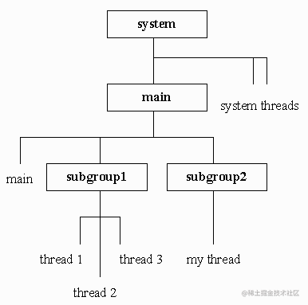

下面介绍一下线程组树的结构

1. JVM 创建的 system 线程组是用来处理 JVM 系统任务的线程组，比如都西昂的销毁等。
2. system 线程组的直接子线程组是 main 线程组，这个线程组至少包括一个 main 线程，用于执行 main 方法。
3. main 线程组的子线程组就是应用程序创建的线程组

线程组 ThreadLocal 部分源码：

```java
public
class ThreadGroup implements Thread.UncaughtExceptionHandler {
    // 父线程组
    private final ThreadGroup parent;
    
    // ThreadGroup 的名称
    String name;
    
    // 线程最大优先级
    int maxPriority;
    
    // 是否已经被销毁
    boolean destroyed;
    
    // 是否是守护进程
    boolean daemon;

    // 还未启动的进程数量
    int nUnstartedThreads = 0;
    
    // 线程总数
    int nthreads;
    
    // 存储线程
    Thread threads[];

    // 线程组数量
    int ngroups;
    // 存储子线程组
    ThreadGroup groups[];
    
    // 其他成员方法和成员属性 ... ...
}
```

可以在main方法中看到JVM创建的system线程组和main线程组:

```java
package com.congee02.multithread.group;

public class MainThreadGroupInsight {

    public static void main(String[] args) {
        // 获取当前线程的线程组
        ThreadGroup mainThreadGroup = Thread.currentThread().getThreadGroup();
        
        // 获取当前线程的线程组的父线程组
        ThreadGroup mainThreadGroupParent = mainThreadGroup.getParent();

        // 当前线程为 main 线程，隶属于 main 线程组
        System.out.println("mainThreadGroup: " + mainThreadGroup);
        
        // main 线程组的父线程组为 system
        System.out.println("mainThreadGroupParent: " + mainThreadGroupParent);
    }

}


```

运行结果

```java
mainThreadGroup: java.lang.ThreadGroup[name=main,maxpri=10]
mainThreadGroupParent: java.lang.ThreadGroup[name=system,maxpri=10]
```

一个线程可以访问其所属线程组的信息，但不能访问其线程组的父线程组或其他线程组的信息，也就是说线程组是一个向下引用的树状结构，这样设计是为了防止下级获取上级的引用而无法被 GC 回收。

#### 线程组的构造器

ThreadGroup 提供了两个构造函数

| Constructor                                  | Description                                              |
| -------------------------------------------- | -------------------------------------------------------- |
| ThreadGroup(String name)                     | 根据线程组名称创建线程组，其父线程组为当前线程的线程组   |
| ThreadGroup(ThreadGroup parent, String name) | 根据线程组名称创建线程组，其父线程组为指定的parent线程组 |

下面演示这两个构造器的使用

```java
package com.congee02.multithread.group;

public class ThreadGroupCreate {

    public static void main(String[] args) {

        // 若未指定，默认的父线程组为 main
        ThreadGroup subThreadGroup1 = new ThreadGroup("subThreadGroup1");
        // 指定默认父线程组为 subThreadGroup1
        ThreadGroup subThreadGroup2 = new ThreadGroup(subThreadGroup1, "subThreadGroup2");

        System.out.println("Parent of subThreadGroup1: " + subThreadGroup1.getParent());
        System.out.println("Parent of subThreadGroup2: " + subThreadGroup2.getParent());

    }

}

```

```java
Parent of subThreadGroup1: java.lang.ThreadGroup[name=main,maxpri=10]
Parent of subThreadGroup2: java.lang.ThreadGroup[name=subThreadGroup1,maxpri=10]
```

#### 线程组的常用方法

1. 获取当前线程组名字

   ThreadGroup#getName()

2. 从线程组中提取活动线程数组

   ```java
   package com.congee02.multithread.group;
   
   import java.util.Arrays;
   import java.util.Random;
   
   public class ExtractThreadsFromThreadGroup {
   
       private final static Random random = new Random();
       private final static Runnable helloRunnable = () -> {
           try {
               Thread.sleep(random.nextInt(100));
           } catch (InterruptedException e) {
               e.printStackTrace();
           }
           System.out.println("Hello from " + Thread.currentThread().getName() + ".");
       };
   
       private final static int THREAD_NUM = 10;
   
       public static void main(String[] args) {
           ThreadGroup threadGroup = new ThreadGroup("subThreadGroup");
           for (int i = 0 ; i < THREAD_NUM ; i ++ ) {
               new Thread(threadGroup, helloRunnable).start();
           }
           Thread[] extractActiveThreads = new Thread[threadGroup.activeCount()];
           threadGroup.enumerate(extractActiveThreads);
           System.out.println(Arrays.toString(extractActiveThreads));
       }
   
   }
   
   ```

3. 线程组统一异常处理

   ```java
   package com.congee02.multithread.group;
   
   public class ThreadGroupUnifiedExceptionManagement {
   
       public static void main(String[] args) {
           ThreadGroup group
                   = new ThreadGroup("Print-Uncaught-Exception-ThreadGroup") {
               @Override
               // 重写处理异常的方法
               public void uncaughtException(Thread t, Throwable e) {
                   System.out.println(t.getName() + " throws a exception:  " + e.getMessage());
               }
           };
   
           Thread thread = new Thread(group, () -> {
               // 抛出一个异常
               throw new RuntimeException("This is a testing Exception.");
           }, "Throw-Exception-Thread");
   
           thread.start();
       }
   
   }
   
   ```

### 线程优先级

线程的优先级级别由操作系统决定，不同的操作系统级别是不一样的，在 Java 中，提供了一个级别范围 1~10 以方便参考。Java 默认的优先级为 5，线程的执行顺序由调度程序来决定，线程的优先级会在线程调用之前设定。

Thread 中定义了三个静态方法来确定线程优先级

```java
/**
 * The minimum priority that a thread can have.
 */
public static final int MIN_PRIORITY = 1;

/**
 * The default priority that is assigned to a thread.
 */
public static final int NORM_PRIORITY = 5;

/**
 * The maximum priority that a thread can have.
 */
public static final int MAX_PRIORITY = 10;
```

获取线程优先级别 Thread#getPriority()

```java
package com.congee02.multithread.priority;

public class ThreadPriorityInsight {

    public static void main(String[] args) {
        new Thread(() -> {
            Thread currentThread = Thread.currentThread();
            System.out.println("Priority level of " + currentThread.getName() + " is " + currentThread.getPriority());
        }, "Default-Priority-Thread").start();
    }

}
```

设置线程优先级别 Thread#setPriority

```java
package com.congee02.multithread.priority;

public class ThreadPrioritySet {

    private static final Runnable getPriorityRunnable = () -> {
        Thread thread = Thread.currentThread();
        System.out.println("The priority of " + thread.getName() + " is " + thread.getPriority());
    };

    public static void main(String[] args) {

        Thread highPriorityThread = new Thread(getPriorityRunnable, "HighPriorityThread");
        highPriorityThread.setPriority(Thread.NORM_PRIORITY + 3);

        Thread normPriorityThread = new Thread(getPriorityRunnable, "NormPriorityThread");
        normPriorityThread.setPriority(Thread.NORM_PRIORITY);

        Thread lowPriorityThread = new Thread(getPriorityRunnable, "LowPriorityThread");
        lowPriorityThread.setPriority(Thread.NORM_PRIORITY - 3);

        lowPriorityThread.start();
        normPriorityThread.start();
        highPriorityThread.start();

    }

}

```

需要注意，较高优先级的线程只是提高线程先执行的概率，真正的执行顺序由操作系统决定。

运行结果：

```java
The priority of HighPriorityThread is 8
The priority of LowPriorityThread is 2
The priority of NormPriorityThread is 5
```

### 进程 Process  VS 线程 Thread 

| 层面 Aspect                    | 进程 Process                                             | 线程 Thread                                                  |
| ------------------------------ | -------------------------------------------------------- | ------------------------------------------------------------ |
| 定义Definition                 | 有自己独立内存和资源的程序                               | 进程的最小单元                                               |
| 创建 Creation                  | 高昂的创建和管理代价                                     | 轻量级的创建和管理                                           |
| 隔离 Isolation                 | 进程之间互相隔离。一个进程崩溃不会直接影响到其他进程。   | 隶属于同一进程的线程共享相同的地址空间和资源，所以线程也可以影响到整个线程 |
| 通信 Communication             | 介于进程之间的隔离性，进程间的通信较为复杂。             | 线程共享相同的内存地址空间和资源，所以无需复杂的线程间通信就可以直接访问和修改共享的内存区域 |
| 上下文切换 Context Switching   | 进程的上下文切换代价更大，更耗时                         | 线程的上下文切换代价更小，更块                               |
| 资源额外开销 Resource Overhead | 每个线程都有自己独立的内存空间和系统资源，额外开销较大   | 线程间共享资源，因此有更小的资源额外开销                     |
| 容错度 Fault Tolerance         | 鉴于进程间的隔离性，有较大容错度                         | 一个线程与其他线程共享计算机资源，且隶属于某个线程，因而容错度较小 |
| 可伸缩性 Scalability           | 鉴于管理进程的额外开销，可伸缩性较差                     | 鉴于其轻量，线程有更好的可伸缩性                             |
| 并行性 Prallelism              | 线程可以在多核 CPU 上并行运行                            | 线程可以在线程中并行执行                                     |
| 同步 Synchronization           | 需要更加复杂的通信机制(Inter-Process Communication, IPC) | 同步更加容易实现（共享内存）                                 |
| 例子 Example                   | 多个浏览器程序各自独立运行                               | 一个浏览器使用多个线程来页面渲染和网络传输等等               |


### 多线程引发的问题

多线程引发的问题被分为三大类：线程安全性问题、活跃性问题、性能问题。

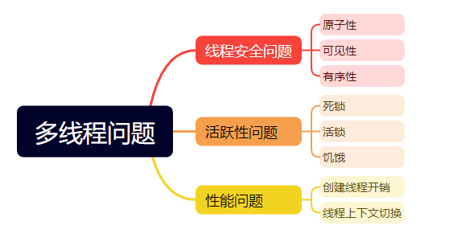

#### 线程安全问题

##### 原子性

一个操作或者多个操作，要么全部执行并且执行的过程中不会被任何因素打断，要么不执行。

原子操作：不会被线程调度机制打断的操作，没有上下文切换

原子性典型的例子是银行转账问题。

银行转账分为两个操作：汇款 和 收款

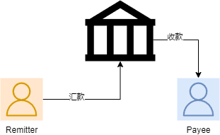

如果汇款和收款两个操作不具有原子性。汇款操作成功，汇款人的账户减去金额给银行。但是此后因为一些原因，收款操作突然终止，收款人没有收到钱，这里就出现了问题。

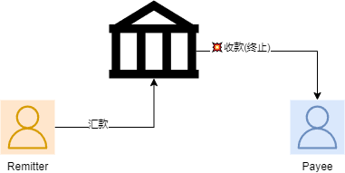

在并发编程中，很多操作不是原子操作。

```java
i = 0;		// 0
i ++;		// 1
i = j;		// 2
i = i + 1;	// 3
```

上述四个操作中，只有操作0是原子方法，其他操作都包含多个步骤：

- 操作0

  将字面量 0 直接赋值给 i

- 操作1

  读取 i 的值 -> 对 i 加 1

- 操作2

  读取 j 的值 -> 将 j 的值赋值给 i

- 操作3

  读取 i -> 计算 i + 1 -> 将 i + 1 复制给 i

在多线程的环境下，每个线程共享这些变量，如果不使用锁机制等手段进行控制，可能会得到意料之外的值。

在 Java语言 中，可以使用 synchronized 和 lock 来保证操作的原子性。

例子，多线程计数器：

```java
package com.congee02.multithread.atomicity;

import java.util.Random;

public class SynchronizedAtomicityOperation {

    /**
     * 原子操作的计数器
     */
    private static class AtomicIncrementCounter {

        // 创建一个锁对象
        private final Object lock = new Object();

        private int count = 0;

        public void increment() {
            synchronized (lock) {
                count ++;
                System.out.println("Thread " + Thread.currentThread().getName() + " executed increment().");
            }
        }

        public int getCount() {
            return count;
        }
    }

    private static final Random random = new Random();

    private static final AtomicIncrementCounter counter = new AtomicIncrementCounter();
    private static final Runnable incrementRunnable = () -> {
        for (int i = 0; i < 100 ; i ++ ) {
            try {
                Thread.sleep(random.nextInt(10));
            } catch (InterruptedException e) {
                e.printStackTrace();
            }
            counter.increment();
        }
    };

    public static void main(String[] args) {

        Thread firstThread = new Thread(incrementRunnable, "firstThread");
        Thread secondThread = new Thread(incrementRunnable, "secondThread");

        firstThread.start();
        secondThread.start();

        // 等待线程执行完成后打印结果
        try {
            firstThread.join();
            secondThread.join();
        } catch (InterruptedException e) {
            e.printStackTrace();
        }

        System.out.println(counter.getCount());
    }

}

```

##### 可见性

当多个线程访问同一变量时，一个线程改变了这个变量的值，其他线程立即能看到修改后的值。


如上图，每个线程都有自己的工作内存，工作内存和主内存的交互靠 store/load 操作。

鉴于可见性问题，Java  提供了 volatile 关键字。当一个变量被  volatile 修饰时：

- 写操作

  写入的值会立即被更新到主内存而非自己的工作内存

- 读操作

  去主内存中读取变量的值

##### 有序性

有序性指程序按照代码的先后顺序执行。

在默认情况下，为了优化性能，程序中语句执行的先后顺序会被改变，称为指令重排。

例如

```java
代码语句:
a = 6;
b = 7;

可能的乱序执行:
b = 7;
a = 6;
```

要具体介绍有序性，我们从设计模式中的懒加载单例模式开始。

在单线程的情况下，懒加载单例模式可以写做：

```java
package com.congee02.multithread.ordered;

public final class NaiveLazyLoadSingleton {

    private NaiveLazyLoadSingleton() {}

    private static NaiveLazyLoadSingleton instance;

    public static NaiveLazyLoadSingleton getInstance() {
        if (instance == null) {
            instance = new NaiveLazyLoadSingleton();
        }
        return instance;
    }

}
```

但是在多线程的情况下，这是不安全的。因为 "instance = new NaiveLazyLoadSingleton();" 不是一个原子操作，它分为这几个步骤：

1. 类加载

   如果类没有被加载，Java 类加载器加载类的字节码文件。

2. 分配内存

   在堆内存中分配足够的内存空间来存储对象的实例变量。

3. 初始化实例变量

   对象的实例变量会被设置为默认值，例如数字类型为 0，引用类型为 null

4. 执行构造函数

   调用类的构造函数，初始化对象的实例变量，执行构造函数中的代码块，完成对象的初始化过程

5. 返回引用

   构造函数执行完毕后，会返回一个指向新创建对象的引用。

在多线程情况下，上述实例化的一些步骤会被指令重排，比如：

1. 分配内存和初始化实例变量

   在多线程情况下，可能会先分配内存，然后另一个线程就能够访问到未完全初始化的对象。这会导致其他线程可能会看到实例变量的默认值，而不是期望的初始化值。

2. 执行构造函数

   在某些情况下，构造函数中的代码可能在对象分配内存之前就被执行

那么，首先将 instance 修饰为 volatile，当一个线程实例化 instance 时，另一个线程立即能在进程的主内存中观察到实例化过程中 instance 值的变化，以保障其可见性。若未被 volatile 修饰，当线程 A 实例化 instance 完成后，另一个线程可能没能见到完整的 instance，进而导致未知的错误。另外 volatile 禁止了对其修饰变量的相关操作的重排序：

- 写-读重排序

  当写操作在读操作之前，线程A的读操作在线程B的写操作进行期间执行，可能会导致线程A看到一个未完全初始化的值。

- 写-写重排序

  当两个写操作的顺序被调整后，可能导致某个线程的写操作被延迟到后面的位置。

- 读-写重排序

  当读操作在写操作之后，读操作可能会读取到旧的值。

其次，将 getInstance() 方法修饰为 synchronized，保证任意时刻至多只有一个线程调用这个方法，防止多个线程同时判断 instance == null 为 true，从而重复创建多个实例。

```java
package com.congee02.multithread.ordered;

public final class NaiveSynchronizedLazyLoadSingleton {

    private NaiveSynchronizedLazyLoadSingleton() {}

    private static volatile NaiveSynchronizedLazyLoadSingleton instance;

    public synchronized static NaiveSynchronizedLazyLoadSingleton getInstance() {
        if (instance == null) {
            instance = new NaiveSynchronizedLazyLoadSingleton();
        }
        return instance;
    }

}

```

现在，这个类是线程安全的，但是我们发现 synchronized 只在 getInstance() 第一次被调用的时候有效，在 getInstance() 第一次被调用结束后， instance 已经被完全实例化，此时允许多个线程同时访问 getInstance() 方法且仍旧保持线程安全，但是其方法依然只能被至多一个线程访问，导致了性能的额外开销。可以使用双重检查锁来解决这个问题，在这里暂且不表。

#### 活跃性问题

活跃性问题指的是某些线程无法继续执行的状态，导致系统无法正常前进。活跃性问题涵盖死锁、活锁和饥饿。

##### 死锁

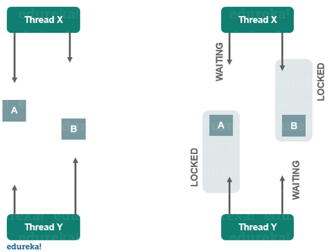

如图：

1. 线程 X 持有资源 B
2. 线程 Y 持有资源 A
3. 线程 X 想要资源 A，但是被线程 Y 占用
4. 线程 Y 想要资源 B，但是被线程 X 占用

在这种情况下，线程 X 和 线程 Y 互相等待对方释放资源，形成了死锁。

线程 X 无法执行，因为它需要资源 A，而线程 Y 占用资源 A。

线程 Y 无法执行，因为它需要资源 B，而线程 X 占用资源 B。

Java 代码如下：

```java
package com.congee02.multithread.liveness;

public class DeadLockDemo {

    private final static Object resourceA = new Object() {
        @Override
        public String toString() {
            return "resource A";
        }
    };
    private final static Object resourceB = new Object() {
        @Override
        public String toString() {
            return "resource B";
        }
    };

    private static class TwoResourceRunnable implements Runnable {

        private final Object firstResource;
        private final Object secondResource;

        public TwoResourceRunnable(Object firstResource, Object secondResource) {
            this.firstResource = firstResource;
            this.secondResource = secondResource;
        }

        @Override
        public void run() {
            String currentThreadName = Thread.currentThread().getName();
            synchronized (firstResource) {
                System.out.println(currentThreadName + ": holding " + firstResource);
                System.out.println(currentThreadName + ": requesting " + secondResource);
                synchronized (secondResource) {
                    System.out.println(currentThreadName + ": get " + secondResource);
                }
                System.out.println(currentThreadName + " finished.");
            }
        }

    }

    public static void main(String[] args) throws InterruptedException {

        Thread x = new Thread(new TwoResourceRunnable(resourceB, resourceA), "X");
        Thread y = new Thread(new TwoResourceRunnable(resourceA, resourceB), "Y");

        x.start();
        y.start();
    }


}

```

运行结果

```java
X: holding resource B
Y: holding resource A
X: requesting resource A
Y: requesting resource B
```


结合上述代码，理解死锁形成的四个必需条件：

1. 互斥条件

   每个资源只能被一个线程占用。在上述代码中，资源 resourceA 和 resourceB 是被 synchronized 块保护的临界资源，只能被一个线程占用。

2. 请求与保持条件

   线程至少持有一个资源，并且正在请求至少一个资源，而请求的资源被其他线程占用。在上述代码中，线程X和线程Y都持有一个资源，并且尝试获取另一个资源。

3. 不可剥夺条件

   资源只能在持有者线程释放后才能被其他线程获取，不能被其他线程强行剥夺。在上述代码中，一旦线程获取了资源的锁，其他线程无法主动剥夺这个锁。

4. 循环等待条件

   多个线程形成一个循环等待资源的环链。如图所示，线程 P<sub>1</sub> 等待线程 线程 P<sub>2</sub> 释放资源 ... 线程 P<sub>n</sub> 等待 线程 P<sub>1</sub> 释放资源。 在上述代码中，线程 X 等待线程 Y 持有的资源，线程 Y 等待线程 X 的资源，形成了循环等待条件。

   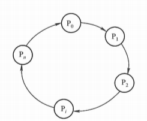

若需要解除死锁，只需要破坏上述四个条件之一即可。 	

##### :first_quarter_moon: 活锁

##### 饥饿

在多线程的情形下，饥饿指一个或者多个线程由于某种原因无法得到其所需的资源，从而无法继续执行。这可能导致线程被长时间阻塞，无法完成其任务。与死锁和活锁不同，饥饿是指一个或多个线程无法取得进展，而不仅仅是线程之间的相互影响。

以下是一个示例， 低优先级的线程若长时间不能得到资源，则运行失败

```java
package com.congee02.multithread.liveness;

import java.util.concurrent.TimeUnit;

public class StarvationDemo {

    private static final Object resource = new Object() {
        @Override
        public String toString() {
            return "resource";
        }
    };

    // 定义一个长时间持有资源的任务
    private final static Runnable holdResourceLongTimeRunnable = () -> {
        String name = Thread.currentThread().getName();
        System.out.println(name + " is trying to access the resource");
        synchronized (resource) {
            System.out.println(name + " acquired the resource.");
            try {
                // 模拟高优先级线程长时间占用资源
                TimeUnit.SECONDS.sleep(10);
            } catch (InterruptedException e) {
                System.out.println(name + " is interrupted.");
            }
            System.out.println(name + " released the resource.");
        }
    };

    private static Thread setThreadPriority(Thread thread, int priority) {
        thread.setPriority(priority);
        return thread;
    }

    public static void main(String[] args) throws InterruptedException {
        // 创建一个优先级最高的线程
        Thread highPriorityThread =
                setThreadPriority(new Thread(holdResourceLongTimeRunnable, "High-Priority-Thread"), Thread.MAX_PRIORITY);

        // 创建一个优先级最低的线程
        Thread lowPriorityThread =
                setThreadPriority(new Thread(holdResourceLongTimeRunnable, "Low-Priority-Thread"), Thread.MIN_PRIORITY);

        // 启动两个线程
        highPriorityThread.start();
        lowPriorityThread.start();

        Thread.sleep(100);

        int count = 0;
        while (lowPriorityThread.getState() == Thread.State.BLOCKED) {
            TimeUnit.SECONDS.sleep(1);
            count ++;
            if (count == 5) {
                System.err.println("Time out, thread" + lowPriorityThread + "becomes invalid.");
                lowPriorityThread.stop();
            }
        }
    }

}

```

代码中，高优先级的线程长时间占用资源，致使低优先级的线程因为长时间未获取到资源而被饿死。

#### 性能问题

即使线程安全和活跃性问题都没有发生，多线程并发也并不一定比串行执行要快。多线程并发编程需要创建进程，而且进程之间需要上下文切换，这些操作都是有代价的，需要考虑。

##### 创建线程开销

创建线程时，需要向系统申请资源。创建线程的开销十分昂贵，需要给新创建的线程分配内存，列入调度等。

##### 线程上下文切换

为了实现多个线程同时运行（宏观上），CPU 为多个不同的线程分配时间片，在时间片内特定线程可以使用 CPU。当一个线程从另一个线程切换过来时，CPU 需要保存现场，并执行下一个线程，这个行为被称为上下文切换。

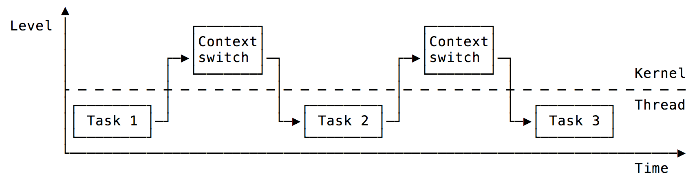

若要减少上下文切换带来的开销，可以：

- 减少线程数目

  过多的线程会产生频繁的上下文切换

- 无锁并发编程

  较为典型的用法为 ConcurrentHashMap 分段锁的思想。ConcurrentHashMap 将数据分为多个段，每个段由一个独立的锁保护，减小整体的锁的竞争程度，以便多个线程可以并发地访问不同的段。总结来说，锁分段是一种优化策略，旨在通过将数据分成多个部分，并为每个部分提供独立的锁，以减小锁竞争的影响，从而提高并发性。能。

- CAS 算法

  CAS 算法在更新数据时，允许尝试更新一个值，仅在值未被其他线程改变时才进行更新，避免了传统锁带来的线程阻塞和切换。

- 使用更轻量级的线程

- 局部性原则

  将相关的数据放在一起，使得线程在执行任务时尽可能使用缓存，减少缓存失效带来的开销。这有助于减小上下文切换的开销。


### Java 内存模型

#### 并发编程模型的通信和同步

线程通信解决线程间如何通信的问题；线程同步保证线程执行顺序正确，依赖于线程通信实现。

主要有两种并发模型解决该问题：

| 模型         | 线程通信                                               | 线程同步                                                     |
| ------------ | ------------------------------------------------------ | ------------------------------------------------------------ |
| 消息传递模型 | 线程间无公共状态。线程间使用消息接发显式地通信。       | 发送消息和接受消息总是有先后顺序的，所以线程间进行隐式的同步。 |
| 共享内存模型 | 线程间有公共状态。通过读写线程间的公共状态隐式地通信。 | 必须使用 sychronized 关键字等手段确认某段代码或者某个变量需要互斥访问，其同步是显式的。 |

在 Java 中，主要使用共享内存模型来进行线程通信和线程同步。

#### Java 抽象内存模型

##### 运行时内存的划分

#### 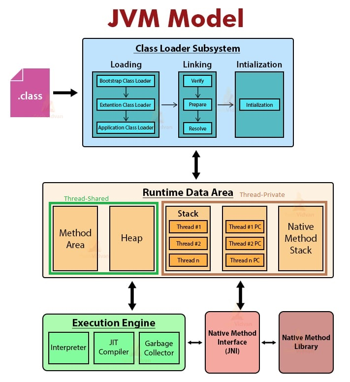

如上图 JVM 模型，在运行时数据区，于任意线程，栈（虚拟机栈 Stack 和本地方法栈 Native Method Stack）和程序计数器（PC）都是私有的，而堆和方法区是共享的。接下来讲讲运行时数据区的各个部分：

- 虚拟机栈（Stack，更确切地说是 VM Stack）

  每个线程都有自己的虚拟机栈，用于存储方法调用的局部变量、操作数栈、方法参数和返回值。每个方法调用在虚拟机上创建一个栈帧（栈帧是用于存储方法调用信息、局部变量和操作数栈的内存区域，支持方法的执行和返回）。

- 本地方法栈（Native Method Stack）

  类似于虚拟机栈，每个线程都有自己的本地方法栈，用于存储本地方法（用 native 关键字修饰的方法）的调用信息和执行状态。

- 程序计数器（Program Counter，PC）

  每个线程都有一个独立的程序计数器，保存当前线程正在执行的字节码指令的行号。它是线程私有的，用于支持方法调用和线程切换后的恢复。

- 方法区（Method Area）

  方法区存储类的结构信息，包括类的成员变量、方法代码、静态变量、常量池等。方法区是所有线程共享的。

- 堆（Heap）

  堆是存储对象实例的区域，所有线程共享。堆内存被用于存储所有创建的对象，包括类的实例和数组。堆是Java内存管理的主要焦点

上面提到，栈和程序计数器是各个线程私有的，那么其中的内容（局部变量、异常处理参数 ... ...）不会在线程之间共享，也就不会产生可见性问题。要研究可见性问题，应该着眼于线程共享的方法区和堆区。

##### 如果堆是共享的，为什么堆中可能存在不可见问题？

首先需要阐明不可见问题和堆的共享性无关，而是和多线程本身的并发访问有关。

当一个线程修改一个未被 volatile 修饰的变量时，修改先在自己线程独有的工作内存中应用，而不会立马在主内存中应用更改，而其他线程不能在主内存新的值。

当一个线程访问一个未被 volatile 修饰的变量时，该变量的修改可能已经在其他线程的工作内存应用，而没有应用到主内存，可能导致当前线程访问到旧的值甚至是不完整的对象。

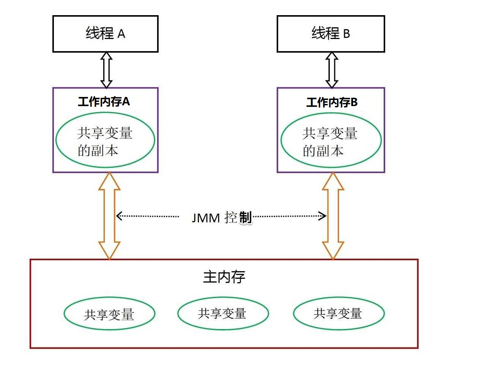

需要注意，上述共享变量都没有被 volatile 关键字修饰

从图中可见：

1. 共享变量的实例都在主内存中，且每个线程都保持至少一份必要的共享变量的副本在自己的工作内存
2. 如果线程 A 需要向线程 B 通信，则线程 A 需要将更新后的共享变量刷新到主内存，此后，线程 B 读取更新后的共享变量。

##### JMM 和 Java 运行时数据区

JMM（Java Memory Model）和 Java 运行时数据区（Java Runtime Data Area）是两个不同的，容易混淆的概念，下面主要说明两者的区别以及联系。

###### Java Memory Model, JMM

JMM 是一种规范，用于定义多线程程序中，线程之间共享变量的访问方式、内存可见性、指令重排等行为。JMM 定义了一系列规则，确保多线程程序在不同线程之间的操作对其他线程可见，并避免出现由于指令重排导致的意外行为。

JMM 的主要目标是提供一种形式化的规范，使得多线程程序中的线程能够正确协同工作，而不会出现数据不一致或者其他意外结果。

简言之，JMM 是一种规范，定义了多线程程序中的内存可见性和访问方式。

###### Java Runtime Data Area, Java 运行时数据区

Java 运行时数据区是 JVM 运行 Java 程序所使用的内存区域的总称。运行时数据区包含了许多个不同的区域，用于存储不同类型的数据，包含 堆、方法区、虚拟机栈、本地方法栈、程序计数器等，记录了类的结构信息、对象实例、线程执行的状态信息等。

简言之，Java 运行时数据区是 Java 程序在运行时所使用的内存划分，用于存储程序的数据和状态。


#### 指令重排

指令重排是编译器和处理器提高程序性能的有效手段。

那么，指令重排如何提高性能？简言之，是通过尽可能地利用现代 CPU 的流水线架构，尽可能减少流水线中断发生的次数。

具体而言，分为以下几点：

1. 流水线

   将指令的执行过程分为多个阶段，以充分利用现代处理器的流水线架构，减少指令执行的等待时间。

2. 减少分支判断

   分支语句可能导致处理器的流水线分支中断，降低性能。通过指令重排，尽量避免分支预测错误，可以减少分支延迟对程序性能的影响。

3. 提高局部性

   指令重排可以让同一段代码在不同的时间点多次执行，从而充分利用指令的缓存，减少缓存的冷启动时间。

    指令重排可以使紧密相关的指令在空间上紧密排列，从而利用处理器的数据缓存。

4. 并行执行

   处理器有多个执行单元，可以同时执行多条指令。指令重排可以使独立的指令并行执行，从而提高整体性能。


## :moon:网络编程


