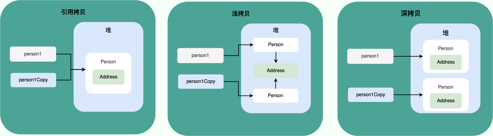

## String JVM 优化

问题提出

```java
String str1 = "ab";
String str2 = "a" + "b";

System.out.println(str1 == str2);

String str3 = "a";
String str4 = "b";
String str5 = str3 + str4;

System.out.println(str1 == str5);
```

上面打印 true，下面打印 false ，为什么？

因为 JVM 尽可能地会使用一个对象。

str2 后的字符串拼接是多个字面量字符串，JVM 可以确定其拼接结果是 "ab"，故重复使用 str1 指向的字符串对象，所以 str1 == str2 成立；

而在下面 str5 = str3 + str4 中，str3 + str4，JVM 不确定连接后的字符串是什么，只能创建一个新的字符串对象，所以str1 == str5 不成立

```java
package com.congee02.optimize;

public class StringContactOptimize {

    public static void main(String[] args) {

        String str1 = "ab";
        // 静态字符串连接，JVM 会尽量使用一个对象
        // JVM 可以确定连接后的字符串为 "ab" ，则指向已有常量池中的字符串
        String str2 = "a" + "b";

        System.out.println(str1 == str2);   // true

        String str3 = "a";
        String str4 = "b";
        // 至少有一个字符串是由变量标识，然后相加，
        // 被视为动态字符串连接，因此返回的是一个新的String对象
        // JVM 不能确定连接后的字符串是什么，只能新创建一个字符串对象
        String str5 = str3 + str4;

        System.out.println(str1 == str5);   // false

    }

}

```

那么如果强制 new String 而不用已有的字符串呢

```java
package com.congee02.optimize;

public class StringForceNew {

    public static void main(String[] args) {
        String str1 = "ab";
        String str2 = new String(str1);
        System.out.println(str1 == str2);
    }

}

```

打印结果为 false

### 思考：String s1 = new String("abc") 这个语句创建了几个字符串对象

#### 字符串常量池

为了更加清楚明白地探讨这个问题，需要先了解什么是字符串常量池？

字符串常量池（String Pool）是 Java 在方法区内的一种特殊的存储区域，用于存储字符串常量（字符串对象），旨在节省内存并提高性能。

需要注意，在字符串常量池中，字符串常量允许多个变量引用相同的字符串对象，以减少创建重复的内容，节省内存空间。

首先，什么样的字符串会被放置到堆中：

1. 通过 new 关键字创建的字符串对象：String str1 = new String(new char[]{'H', 'E', 'E'});
2. 在运行时使用字符串变量连接创建的字符串：比如 String str2 = str1 + "Hello"

那么，什么样的字符串会被加入到字符串常量池：

1. 直接赋值的字符串常量：String hello = "Hello, World!";

2. 只有字符串常量的连接：String concatHello = "Hello, " + "World!";

   ```java
   package com.congee02;
   
   public class CompileStringPool {
   
       public static void main(String[] args) {
           String hello = "Hello, World!";
           String concatHello = "Hello, " + "World!";
           // 编译时优化，hello 和 concatHello 指向字符常量池中同一个字符串对象
           System.out.println(hello == concatHello);   // true
       }
   
   }
   ```

3. 调用 String 类的 intern() 方法：使用 String#intern() ，其过程为：

   - **查找字符串常量池中是否已存在相同内容的字符串**：若有，则直接返回字符串常量池现有的字符出啊对象
   - **如果不存在，将字符串添加到字符串常量池**：如果不存在，则将当前字符串对象加入到字符串常量池，然后返回常量池中的引用

   ```java
   package com.congee02;
   
   import java.util.Arrays;
   
   public class RuntimeStringPool {
   
       private static final char[] chars = {'H', 'e', 'l', 'l', 'o', ',', ' ', 'W', 'o', 'r', 'l', 'd', '!'};
   
       public static void main(String[] args) {
           // s 所指向的字符串对象创建在堆中
           String s = new String(chars);
           // hello 所指向的字符串对象创建在字符串常量池中
           String hello = "Hello, World!";
           // 一个在堆中，一个在字符串常量池中，其地址肯定不同
           System.out.println(s == hello); // false
   
           // 调用 intern() 方法，返回在字符串常量池中的字符串对象引用
           String intern = s.intern();
           System.out.println(intern == hello);    // true
       }
   
   }
   
   ```

前两种方法依赖编译时优化，后一种方法依赖运行时添加。


## Integer 缓存

```java
package com.congee02.optimize;

public class IntegerCacheOptimize {

    private static boolean integerEquals(Integer i1, Integer i2) {
        return i1 == i2;
    }

    public static void main(String[] args) {
        // -128 到 127 为 true
        // 这是因为 Integer.IntegerCache 中默认将 -128 到 127 的 Integer 对象创建好了
        // 每次取值为 -128 到 127 的 Integer 对象时，从 IntegerCache 中取即可，不再创建新的对象
        for (int i = -256 ; i < 256 ; i ++ ) {
            System.out.println("i = " + i + "; equals: " + integerEquals(i, i));
        }

        // 不从缓存中取，强制创建新的 Integer 对象
        // 全为 false
        for (int i = -256 ; i < 256 ; i ++ ) {
            System.out.println("i = " + i + "; newEquals: " + integerEquals(new Integer(i), new Integer(i)));
        }
    }


}

```

为什么当 i 为 -128 到 127 时，i1 == i2 为 true？

这是 Java 基于缓存思想的优化，在 Integer 中，有一个私有静态类 IntegerCache，用来存储 -128 到 127 之间的 Integer 对象。当使用这个范围内的 int 装箱为 Integer 时，实际上是从 IntegerCache 中取出了一个 Integer 对象，而不是创建了一个新的对象。

如果每次我们每次判断时都手动装箱，不从 IntegerCache 中取已经创建好的对象，则判断全为 false。

另外，类似地，Byte，Short，Long 这三种包装类也创建了 -128 到 127 的相应类型的缓存数据，Character 创建了 0 到 127 的缓存数据，Boolean 直接返回 TRUE 和 FALSE 已经创建的对象。而 Float 和 Double 没有类似的缓存机制。

```java
public final class Boolean implements java.io.Serializable,
                                      Comparable<Boolean>
{
    /**
     * The {@code Boolean} object corresponding to the primitive
     * value {@code true}.
     */
    public static final Boolean TRUE = new Boolean(true);

    /**
     * The {@code Boolean} object corresponding to the primitive
     * value {@code false}.
     */
    public static final Boolean FALSE = new Boolean(false);
	......	......
}
```

## Java 拷贝

### 引用拷贝

两个不同的引用指向同一个对象。

### 浅拷贝

创建一个新的对象，然后赋值原始对象的字段值到新对象中。然而如果原始对象包含了引用类型的字段（数组或者对象），那么浅拷贝会复制这些字段的引用，而不是创建它们的副本。

### 深拷贝

深拷贝是创建一个新的对象，并且递归地复制原始对象中所有引用对象及其字段的副本。这意味着在新对象会创建独立的副本，新旧对象不共享任何数据。



```java
package com.congee02;

import com.congee02.entity.Person;

public final class ObjectCopy {

    public static void main(String[] args) {
        // 1. 引用拷贝
        Person person = new Person("Zhejiang");
        Person personReferenceCopy = person;
        System.out.println(person == personReferenceCopy); // true

        // 2. 浅拷贝
        Person shallowCopy = person.shallowCopy();
        System.out.println(shallowCopy.getAddress() == person.getAddress());    // true

        //3. 深拷贝
        Person deepCopy = person.deepCopy();
        System.out.println(deepCopy.getAddress() == person.getAddress());       // false
    }

}

```

## 异常
### 切忌在 try-finally 中使用 return

JVM 规定，当 try 代码块和 finally 代码块中都有 return 时，try 代码块中的 return 语句会被忽略。

If the `try` clause executes a *return*, the compiled code does the following:

1. Saves the return value (if any) in a local variable.
2. Executes a *jsr* to the code for the `finally` clause.
3. Upon return from the `finally` clause, returns the value saved in the local variable.

```java
public class TryFinallyReturn {

    public static void main(String[] args) {
        System.out.println(f());    // 20
    }

    private static int f() {
        try {
            return 10;
        } finally {
            return 20;
        }
    }

}
```

### finally 代码块不一定会被执行

以下三种情况下 finally 代码块不一定会被执行

1. finally 之前虚拟机被终止
2. 程序所有线程死亡
3. 关闭 CPU

这里演示第一种情况

```java
package com.congee02;

public class FinallyAbort {

    public static void main(String[] args) {
        try {
            System.out.println("Try to do something.");
            throw new RuntimeException("RuntimeException For Test");
        } catch (RuntimeException e) {
            System.out.println("Catch RuntimeException: " + e.getMessage());
            System.exit(1);     // VM 虚拟机终止
        } finally {
            System.out.println("Finally code block executed");  // 不会被打印
        }
    }

}

```

### Checked Exception 和 Unchecked Exception 有什么区别

Checked Exception，受检查异常。在编译期间，如果受检查异常没有被  try-catch 或者 throws 处理的话，代码就无法通过编译。常见的受检查异常有：IO 相关的异常，SQLException，ClassNotFoundException。

```java
package com.congee02;

public class CheckedExceptionExample {

    public static void main(String[] args) {
        try {
            Class.forName("jdk.net.Sockets");
        } catch (ClassNotFoundException e) {
            e.printStackTrace();
        }
    }

}

```


Unchecked Exception，不受检查异常。在编译期间，即使不处理不受检查异常也可以编译通过。RuntimeException 及其子类统称为不受检查异常。常见的不受检查异常有：

- NullPointerException：空指针错误
- IllegalArgumentException：参数错误
- ArrayIndexOutOfBoundsException：数组越界错误
- ClassCastException：类型转换错误
- ... ...

```java
package com.congee02;

public class UncheckedExceptionExample {

    public static void main(String[] args) {
        Object o = new Object();
        String s = (String) o;  // throws ClassCastException
    }

}

```

### 异常使用注意事项	

- 不要把异常定义为静态变量，因为这样会导致异常栈信息错乱。每次手动抛出异常，我们都需要手动 new 一个异常对象抛出。

- 抛出的异常信息一定要有意义。

- 建议抛出更加具体的异常比如字符串转换为数字格式错误的时候应该抛出`NumberFormatException`而不是其父类`IllegalArgumentException`。

- 使用日志打印异常之后就不要再抛出异常了（两者不要同时存在一段代码逻辑中）。


## 增强 for 循环

增强型 `for` 循环适用于只读遍历，而传统的 `for` 循环更适合于需要修改集合或数组内容的情况。

### 增强 for 循环遍历数组

使用增强型 `for` 循环（也称为 "foreach" 循环）来遍历数组时，不能直接修改数组的内容。增强型 `for` 循环提供了简洁的语法来遍历数组或集合中的元素，但是在循环体内无法直接修改元素的值。

用增强 for 循环遍历数组

```java
package com.congee02;

import java.util.Arrays;

public class ArrayEnhancedForLoop {

    public static void main(String[] args) {
        Integer[] is = {1, 2, 3};
        for (Integer i : is) {
            i += 1;
        }
        System.out.println(Arrays.toString(is));
    }

}

```

运行结果：

```perl
[1, 2, 3]
```

看一下反汇编代码：

```java
//
// Source code recreated from a .class file by IntelliJ IDEA
// (powered by FernFlower decompiler)
//

package com.congee02;

import java.util.Arrays;

public class ArrayEnhancedForLoop {
    public ArrayEnhancedForLoop() {
    }

    public static void main(String[] args) {
        Integer[] is = new Integer[]{1, 2, 3};
        Integer[] var2 = is;
        int var3 = is.length;

        for(int var4 = 0; var4 < var3; ++var4) {
            Integer i = var2[var4];
            i = i + 1;
        }

        System.out.println(Arrays.toString(is));
    }
}

```

可见，在遍历数组时，会创建一个当前遍历元素的副本并操作，所以在 增强for循环遍历数组时对元素的操作实际上不会影响其数组内容。

### 增强 for 循环遍历 Collection 集合

当增强 for 循环遍历 Collction 集合时，实际上是调用了 Collection#iterator() 方法获取当前集合的迭代器，然后在迭代时创建一个当前遍历元素的副本进行操作，所以不会影响 Collection 集合内容。

增强 for 循环遍历 Collection 集合

```java
package com.congee02;

import java.util.ArrayList;
import java.util.Arrays;

public class CollectionEnhancedForLoop {

    public static void main(String[] args) {
        ArrayList<Integer> list = new ArrayList<>(Arrays.asList(1, 2, 3, 4));
        for (int i : list) {
            System.out.println(i);
        }
    }

}

```


```java
//
// Source code recreated from a .class file by IntelliJ IDEA
// (powered by FernFlower decompiler)
//

package com.congee02;

import java.util.ArrayList;
import java.util.Arrays;
import java.util.Iterator;

public class CollectionEnhancedForLoop {
    public CollectionEnhancedForLoop() {
    }

    public static void main(String[] args) {
        ArrayList<Integer> list = new ArrayList(Arrays.asList(1, 2, 3, 4));
        Iterator var2 = list.iterator();

        while(var2.hasNext()) {
            int i = (Integer)var2.next();
            System.out.println(i);
        }

    }
}

```


## List 子列表元素的改变会作用到源列表中

这是极其明显的，可以查看 ArrayList 的 subList 实现。

```java
public List<E> subList(int fromIndex, int toIndex) {
    subListRangeCheck(fromIndex, toIndex, size);
    return new SubList<>(this, fromIndex, toIndex);
}
```

返回的是一个 SubList 类型，是 ArrayList 的内部类。

```java
private static class SubList<E> extends AbstractList<E> implements RandomAccess {
    private final ArrayList<E> root;
    private final SubList<E> parent;
    private final int offset;
    private int size;

    /**
     * Constructs a sublist of an arbitrary ArrayList.
     */
    public SubList(ArrayList<E> root, int fromIndex, int toIndex) {
        this.root = root;
        this.parent = null;
        this.offset = fromIndex;
        this.size = toIndex - fromIndex;
        this.modCount = root.modCount;
    }
    
    // ... ... ... ...
}
```

每次 SubList 执行操作时，实际上是操作其 root 也就是其祖先 ArrayList。

```java
public E set(int index, E element) {
    Objects.checkIndex(index, size);
    checkForComodification();
    E oldValue = root.elementData(offset + index);
    root.elementData[offset + index] = element;
    return oldValue;
}

public E get(int index) {
    Objects.checkIndex(index, size);
    checkForComodification();
    return root.elementData(offset + index);
}

public int size() {
    checkForComodification();
    return size;
}

public void add(int index, E element) {
    rangeCheckForAdd(index);
    checkForComodification();
    root.add(offset + index, element);
    updateSizeAndModCount(1);
}

public E remove(int index) {
    Objects.checkIndex(index, size);
    checkForComodification();
    E result = root.remove(offset + index);
    updateSizeAndModCount(-1);
    return result;
}

protected void removeRange(int fromIndex, int toIndex) {
    checkForComodification();
    root.removeRange(offset + fromIndex, offset + toIndex);
    updateSizeAndModCount(fromIndex - toIndex);
}

public boolean addAll(Collection<? extends E> c) {
    return addAll(this.size, c);
}
```


## Java 方法普通对象参数传递为浅拷贝，数组为深拷贝

```java
package com.congee02;

import com.congee02.entity.Address;
import com.congee02.entity.Person;
import com.congee02.utils.DemonstrateEntity;

import java.util.Arrays;

public class MethodObjectPass {

    private static void printPersonIdentityAndSetAddress(Person person) {
        System.out.println(System.identityHashCode(person));
        // 能影响 person 内部的内容，但是不能影响 person。所以为浅拷贝
        person.setAddress(new Address("甘肃"));
        person = null;
    }

    private static void swap(int[] arr, int x, int y) {
        int t = arr[x];
        arr[x] = arr[y];
        arr[y] = t;
    }

    private static final Runnable normalPassValue = DemonstrateEntity.create("1. 参数传递拷贝", () -> {
        final Person person = new Person("浙江");
        printPersonIdentityAndSetAddress(person);
        System.out.println(System.identityHashCode(person));
        System.out.println(person);
    });

    private static final Runnable arrayPassValue = DemonstrateEntity.create("2. 数组参数传递", () -> {
        int[] is = {1, 2, 3};
        System.out.println("源数组: " + Arrays.toString(is));
        swap(is, 0, 1);
        System.out.println("交换索引为 0 和 1 的数: " + Arrays.toString(is));
    });

    public static void main(String[] args) {
        normalPassValue.run();
        arrayPassValue.run();
    }

}

```

运行结果：

```
----------	1. 参数传递拷贝	----------
2137211482
2137211482
Person{address=Address{address='甘肃'}}
----------	2. 数组参数传递	----------
源数组: [1, 2, 3]
交换索引为 0 和 1 的数: [2, 1, 3]
```


### 隐式类型转化是针对于基本数据类型来说的

```java
long l = 2; 	// 基本类型隐式转换，编译通过
Long l1 = 2; 	// 包装类不支持隐式类型
```

